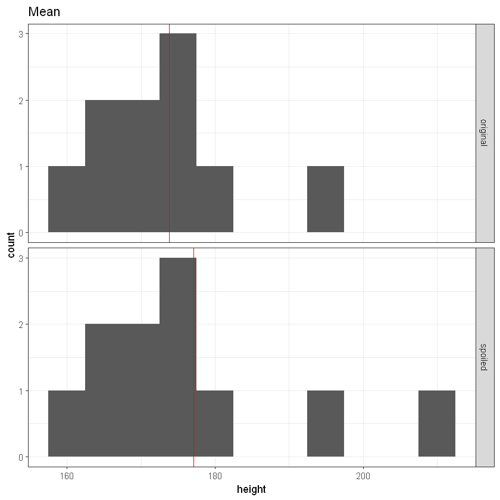
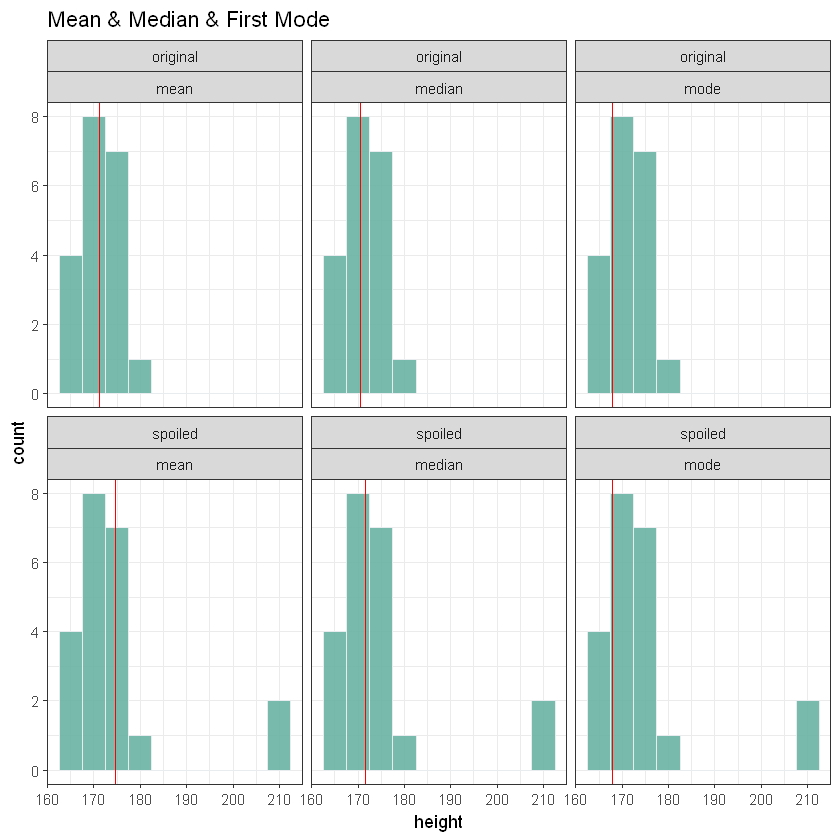
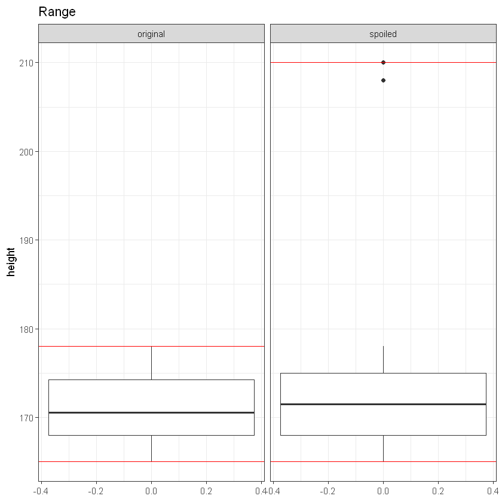
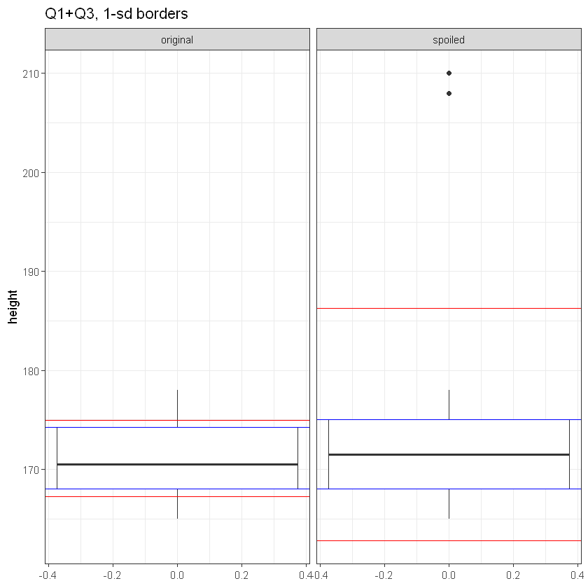
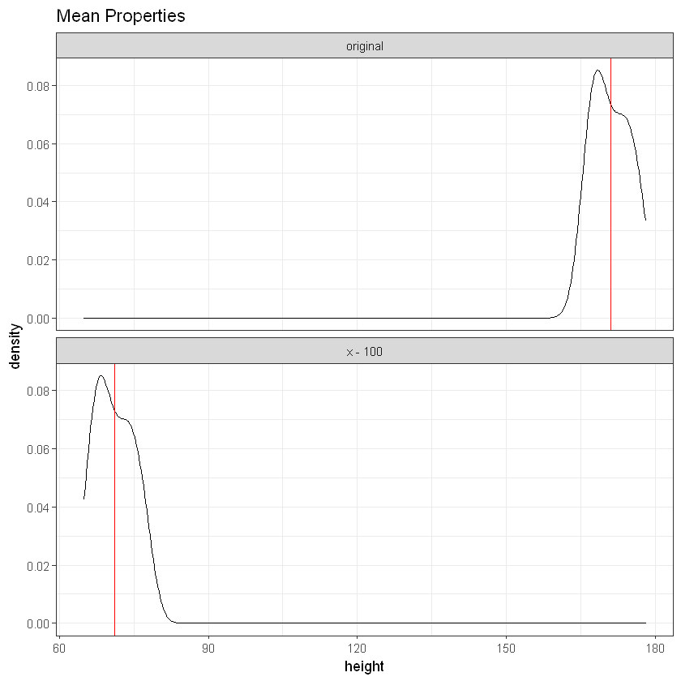

# title: "Descriptive Statistics"


```R
library(mlbench)
library(ggplot2)
library(dplyr)
library(tidyr)
library(ggthemes)
```

## Basics
### Data Overview


```R
data(PimaIndiansDiabetes2)
df <- PimaIndiansDiabetes2
str(df)
```

    'data.frame':	768 obs. of  9 variables:
     $ pregnant: num  6 1 8 1 0 5 3 10 2 8 ...
     $ glucose : num  148 85 183 89 137 116 78 115 197 125 ...
     $ pressure: num  72 66 64 66 40 74 50 NA 70 96 ...
     $ triceps : num  35 29 NA 23 35 NA 32 NA 45 NA ...
     $ insulin : num  NA NA NA 94 168 NA 88 NA 543 NA ...
     $ mass    : num  33.6 26.6 23.3 28.1 43.1 25.6 31 35.3 30.5 NA ...
     $ pedigree: num  0.627 0.351 0.672 0.167 2.288 ...
     $ age     : num  50 31 32 21 33 30 26 29 53 54 ...
     $ diabetes: Factor w/ 2 levels "neg","pos": 2 1 2 1 2 1 2 1 2 2 ...
    


```R
summary(df)
```


        pregnant         glucose         pressure         triceps     
     Min.   : 0.000   Min.   : 44.0   Min.   : 24.00   Min.   : 7.00  
     1st Qu.: 1.000   1st Qu.: 99.0   1st Qu.: 64.00   1st Qu.:22.00  
     Median : 3.000   Median :117.0   Median : 72.00   Median :29.00  
     Mean   : 3.845   Mean   :121.7   Mean   : 72.41   Mean   :29.15  
     3rd Qu.: 6.000   3rd Qu.:141.0   3rd Qu.: 80.00   3rd Qu.:36.00  
     Max.   :17.000   Max.   :199.0   Max.   :122.00   Max.   :99.00  
                      NA's   :5       NA's   :35       NA's   :227    
        insulin            mass          pedigree           age        diabetes 
     Min.   : 14.00   Min.   :18.20   Min.   :0.0780   Min.   :21.00   neg:500  
     1st Qu.: 76.25   1st Qu.:27.50   1st Qu.:0.2437   1st Qu.:24.00   pos:268  
     Median :125.00   Median :32.30   Median :0.3725   Median :29.00            
     Mean   :155.55   Mean   :32.46   Mean   :0.4719   Mean   :33.24            
     3rd Qu.:190.00   3rd Qu.:36.60   3rd Qu.:0.6262   3rd Qu.:41.00            
     Max.   :846.00   Max.   :67.10   Max.   :2.4200   Max.   :81.00            
     NA's   :374      NA's   :11                                                


### Descriptive Statistics


```R
vec <- df$mass
summary(vec)
```


       Min. 1st Qu.  Median    Mean 3rd Qu.    Max.    NA's 
      18.20   27.50   32.30   32.46   36.60   67.10      11 


```R
min(vec)
max(vec)
mean(vec)
median(vec)
```


&lt;NA&gt;


&lt;NA&gt;


&lt;NA&gt;


&lt;NA&gt;


```R
min(vec, na.rm = T)
max(vec, na.rm = T)
mean(vec, na.rm = T)
median(vec, na.rm = T)
```


18.2


67.1


32.457463672391


32.3


```R
quantile(vec, na.rm = T)
quantile(vec, probs = c(0.25, 0.75), na.rm = T)
```


<dl class=dl-horizontal>
	<dt>0%</dt>
		<dd>18.2</dd>
	<dt>25%</dt>
		<dd>27.5</dd>
	<dt>50%</dt>
		<dd>32.3</dd>
	<dt>75%</dt>
		<dd>36.6</dd>
	<dt>100%</dt>
		<dd>67.1</dd>
</dl>


<dl class=dl-horizontal>
	<dt>25%</dt>
		<dd>27.5</dd>
	<dt>75%</dt>
		<dd>36.6</dd>
</dl>


```R
length(vec)

sum(is.na(vec))
```


768


11


```R
sd(vec, na.rm = T)
var(vec, na.rm = T)

sqrt(var(vec, na.rm = T))
sd(vec, na.rm = T)^2
```


6.9249883321059


47.9554633998029


6.9249883321059


47.9554633998029


```R
vec_clean <- na.omit(vec)
sd(vec_clean)
```


6.9249883321059


```R
range(vec_clean)
IQR(vec_clean)
```


<ol class=list-inline>
	<li>18.2</li>
	<li>67.1</li>
</ol>


9.1


#### TASK #1.1 Measures of Center
- Write your own function or one-liner to calculate mean, median, mode ✓
- Check the correctness using built-in functions for mean and median (there is no function for mode - try your one for different cases) ✓
- Visualize (histogram or density plot) the result for all these measures ✓
- Spoil you data with an outlier and repeat previous step ✓

#### Example


```R
x <- c(175, 176, 182, 165, 167, 172, 175, 196, 158, 172)
x_mean <- mean(x)
x_sp <- c(x, 210)
x_mean_sp <- mean(x_sp)

original <- data.frame(height = x, group = "original")
spoiled <- data.frame(height = x_sp, group = "spoiled")
dataviz <- rbind(original, spoiled)

vline <- data.frame(z = c(x_mean, x_mean_sp), group = c("original", "spoiled"))

ggplot(dataviz, aes(x = height)) +
  geom_histogram(binwidth = 5) +
  geom_vline(aes(xintercept = z),
    vline,
    colour = "red"
  ) +
  facet_grid(group ~ .) +
  theme_bw() +
  ggtitle("Mean")
```





#### Solution


```R
# case 'EVEN'
cat("Even:\n")
x <- c(
  1, 2, 3,
  4, 5, 4,
  3, 2, 1,
  0, 0, 0
)

# one-liners:
calculate_sample_mean <- function(vec) sum(vec) / length(vec)
calculate_sample_median <- function(vec) sum(sort(vec)[floor((length(vec) + 1) / 2):ceiling((length(vec) + 1) / 2)]) / length(sort(vec)[floor((length(vec) + 1) / 2):ceiling((length(vec) + 1) / 2)])
calculate_sample_mode <- function(vec) as.vector(sapply(names(which(table(vec) == max(table(vec)))), as.numeric))


if (calculate_sample_mean(x) == mean(x)) calculate_sample_mean(x)
if (calculate_sample_median(x) == median(x)) calculate_sample_median(x)
calculate_sample_mode(x)

cat("\nOdd:\n")

# case 'ODD'
x <- c(
  1, 2, 3,
  4, 5, 4,
  3, 2, 1,
  0, 0
)

# one-liners:
calculate_sample_mean <- function(vec) sum(vec) / length(vec)
calculate_sample_median <- function(vec) sum(sort(vec)[floor((length(vec) + 1) / 2):ceiling((length(vec) + 1) / 2)]) / length(sort(vec)[floor((length(vec) + 1) / 2):ceiling((length(vec) + 1) / 2)])
calculate_sample_mode <- function(vec) as.vector(sapply(names(which(table(vec) == max(table(vec)))), as.numeric))


if (calculate_sample_mean(x) == mean(x)) calculate_sample_mean(x)
if (calculate_sample_median(x) == median(x)) calculate_sample_median(x)
calculate_sample_mode(x)
```

    Even:
    


2.08333333333333


2


0


    
    Odd:
    


2.27272727272727


2


<ol class=list-inline>
	<li>0</li>
	<li>1</li>
	<li>2</li>
	<li>3</li>
	<li>4</li>
</ol>


```R
x <- round(rnorm(20, 172, 6))
x_mean <- calculate_sample_mean(x)
x_median <- calculate_sample_median(x)
x_first_mode <- calculate_sample_mode(x)[1]

x_sp <- c(x, 210, 208)
x_mean_sp <- calculate_sample_mean(x_sp)
x_median_sp <- calculate_sample_median(x_sp)
x_first_mode_sp <- calculate_sample_mode(x)[1]

original <- data.frame(height = x, group = "original")
spoiled <- data.frame(height = x_sp, group = "spoiled")
dataviz <- rbind(original, spoiled)

vline <- data.frame(
  mean = c(x_mean, x_mean_sp), median = c(x_median, x_median_sp),
  mode = c(x_first_mode, x_first_mode_sp), group = c("original", "spoiled")
)

vline

vline <- vline %>% tidyr::gather(measure, value, -group)


ggplot(dataviz, aes(x = height)) +
  geom_histogram(
    binwidth = 5, fill = "#69b3a2",
    color = "#e9ecef", alpha = 0.9
  ) +
  geom_vline(aes(xintercept = value), vline,
    colour = "red"
  ) +
  facet_wrap(~ group + measure) +
  theme_bw() +
  ggtitle("Mean & Median & First Mode")
```


<table>
<thead><tr><th scope=col>mean</th><th scope=col>median</th><th scope=col>mode</th><th scope=col>group</th></tr></thead>
<tbody>
	<tr><td>171.1000</td><td>170.5   </td><td>168     </td><td>original</td></tr>
	<tr><td>174.5455</td><td>171.5   </td><td>168     </td><td>spoiled </td></tr>
</tbody>
</table>





#### TASK #1.2 Measures of Spread
- Write your own function or one-liner to calculate variance and sd ✓
- Check the correctness using built-in functions ✓
- Visualize (boxplot) the result for: Q1+Q3, 1-sd borders ✓
- Spoil you data with an outlier and repeat previous step ✓
#### Example


```R
x_range <- range(x)
x_range_sp <- range(x_sp)

hline <- data.frame(z = c(x_range, x_range_sp), group = rep(c("original", "spoiled"),
  each = 2
))

ggplot(dataviz, aes(y = height)) +
  geom_boxplot() +
  geom_hline(aes(yintercept = z),
    hline,
    colour = "red"
  ) +
  facet_grid(. ~ group) +
  theme_bw() +
  ggtitle("Range")
```





#### Solution


```R
calculate_sample_variance <- function(vec) (sum((vec - calculate_sample_mean(vec))^2)) / (length(vec) - 1)
calculate_sample_std <- function(vec) calculate_sample_variance(vec)^0.5

if (calculate_sample_variance(x) == var(x)) calculate_sample_variance(x)
if (calculate_sample_std(x) == sd(x)) calculate_sample_std(x)
```


15.0421052631579


3.87841530307907


```R
x_range <- c(calculate_sample_mean(x) - calculate_sample_std(x), calculate_sample_mean(x) +
  calculate_sample_std(x))
x_range_sp <- c(calculate_sample_mean(x_sp) - calculate_sample_std(x_sp), calculate_sample_mean(x_sp) +
  calculate_sample_std(x_sp))

x_q <- quantile(x)[c(2, 4)]
x_q_sp <- quantile(x_sp)[c(2, 4)]


hline <- data.frame(
  OneSd = c(x_range, x_range_sp),
  Q1Q3 = c(x_q, x_q_sp),
  group = rep(c("original", "spoiled"), each = 2)
)

ggplot(dataviz, aes(y = height)) +
  geom_boxplot() +
  geom_hline(aes(yintercept = OneSd), hline, colour = "red") +
  geom_hline(aes(yintercept = Q1Q3), hline, colour = "blue") +
  facet_grid(. ~ group) +
  theme_bw() +
  ggtitle("Q1+Q3, 1-sd borders")
```





### Properties


```R
mean(x - 100)
mean(x) - 100 # 1
mean(x / 100)
mean(x) / 100 # 2
sum(x - mean(x)) # 3
```


71.1


71.1


1.711


1.711


1.13686837721616e-13


#### Example


```R
x_ms_100 <- x - 100

original <- data.frame(height = x, group = "original")
trans_ms <- data.frame(height = x_ms_100, group = "x - 100")
dataviz <- rbind(original, trans_ms)

x_ms_mean <- mean(x_ms_100)
vline <- data.frame(z = c(x_mean, x_ms_mean), group = c("original", "x - 100"))

ggplot(dataviz, aes(x = height)) +
  geom_density() +
  geom_vline(aes(xintercept = z),
    vline,
    colour = "red"
  ) +
  facet_wrap(vars(group), nrow = 2, scales = "free_y") +
  theme_bw() +
  ggtitle("Mean Properties")
```





```R
var(x - 100)
var(x) # 4
var(x / 100)
var(x) / 10000 # 5
sd(x / 100)
sd(x) / 100 # 6
```


15.0421052631579


15.0421052631579


0.00150421052631579


0.00150421052631579


0.0387841530307907


0.0387841530307907


#### TASK #1.3 Properties of Measures
- Check the properties for your sample ✓
- Visualize result tabularly (for # 1-6) and graphically (for # 2 and 6) ✓


```R
data.frame(
  var = c(var(x), var(x - 100)),
  mean = c(mean(x), mean(x) - 100), group = c("original", "x - 100")
)
```


<table>
<thead><tr><th scope=col>var</th><th scope=col>mean</th><th scope=col>group</th></tr></thead>
<tbody>
	<tr><td>15.04211</td><td>171.1   </td><td>original</td></tr>
	<tr><td>15.04211</td><td> 71.1   </td><td>x - 100 </td></tr>
</tbody>
</table>


### Custom Report
#### TASK #1.4 Statistical Report, part 1
Create descriptive statistics on Pima data set (excluding first and last column)
containing information for each column such as:
- Number of valid observations (not NA) ✓
- Number of missing (NA) values ✓
- Mean, Median ✓
- Min, max ✓
- Q1, Q3 ✓
- IQR, SD ✓

Order of columns:
- Measure column first, then all the others in free order
Order of measures:
- As presented below (it is not presented)

Values rounded to the 2nd digit


```R
data(PimaIndiansDiabetes2)
df <- PimaIndiansDiabetes2[c(2:8)]
```


```R
head(df,2)
```


<table>
<thead><tr><th scope=col>glucose</th><th scope=col>pressure</th><th scope=col>triceps</th><th scope=col>insulin</th><th scope=col>mass</th><th scope=col>pedigree</th><th scope=col>age</th></tr></thead>
<tbody>
	<tr><td>148  </td><td>72   </td><td>35   </td><td>NA   </td><td>33.6 </td><td>0.627</td><td>50   </td></tr>
	<tr><td> 85  </td><td>66   </td><td>29   </td><td>NA   </td><td>26.6 </td><td>0.351</td><td>31   </td></tr>
</tbody>
</table>


```R
calculate_sample_summary <- function(df) {
    
    notNAVal <- sapply(df, function(x) length(na.omit(x)))
    NAVal <- (dim(df)[[1]] - notNAVal)
    meanVal <- sapply(df, function(x) mean(x, na.rm = T))
    medianVal <- sapply(df, function(x) median(x, na.rm = T))
    minVal <- sapply(df, function(x) min(x, na.rm = T))
    maxVal <- sapply(df, function(x) max(x, na.rm = T))
    Q1Val <- sapply(df, function(x) quantile(x, na.rm = T)[c(2)])
    Q3Val <- sapply(df, function(x) quantile(x, na.rm = T)[c(4)])
    StdVal <- sapply(df, function(x) sd(x, na.rm = T))
    IQRVal <- (Q3Val - Q1Val)
    
    sample_summary <- rbind(notNAVal, NAVal, meanVal, StdVal, minVal, Q1Val, medianVal, 
        Q3Val, maxVal, IQRVal)
    row.names(sample_summary) <- c("N. Valid", "N. Missing", "Mean", "Std", "Min", 
        "Q1", "Median", "Q3", "Max", "IQR")
    
    sample_summary <- round(sample_summary, 2)
    return(sample_summary)
}
```


```R
calculate_sample_summary(df)
```


<table>
<thead><tr><th></th><th scope=col>glucose</th><th scope=col>pressure</th><th scope=col>triceps</th><th scope=col>insulin</th><th scope=col>mass</th><th scope=col>pedigree</th><th scope=col>age</th></tr></thead>
<tbody>
	<tr><th scope=row>N. Valid</th><td>763.00</td><td>733.00</td><td>541.00</td><td>394.00</td><td>757.00</td><td>768.00</td><td>768.00</td></tr>
	<tr><th scope=row>N. Missing</th><td>  5.00</td><td> 35.00</td><td>227.00</td><td>374.00</td><td> 11.00</td><td>  0.00</td><td>  0.00</td></tr>
	<tr><th scope=row>Mean</th><td>121.69</td><td> 72.41</td><td> 29.15</td><td>155.55</td><td> 32.46</td><td>  0.47</td><td> 33.24</td></tr>
	<tr><th scope=row>Std</th><td> 30.54</td><td> 12.38</td><td> 10.48</td><td>118.78</td><td>  6.92</td><td>  0.33</td><td> 11.76</td></tr>
	<tr><th scope=row>Min</th><td> 44.00</td><td> 24.00</td><td>  7.00</td><td> 14.00</td><td> 18.20</td><td>  0.08</td><td> 21.00</td></tr>
	<tr><th scope=row>Q1</th><td> 99.00</td><td> 64.00</td><td> 22.00</td><td> 76.25</td><td> 27.50</td><td>  0.24</td><td> 24.00</td></tr>
	<tr><th scope=row>Median</th><td>117.00</td><td> 72.00</td><td> 29.00</td><td>125.00</td><td> 32.30</td><td>  0.37</td><td> 29.00</td></tr>
	<tr><th scope=row>Q3</th><td>141.00</td><td> 80.00</td><td> 36.00</td><td>190.00</td><td> 36.60</td><td>  0.63</td><td> 41.00</td></tr>
	<tr><th scope=row>Max</th><td>199.00</td><td>122.00</td><td> 99.00</td><td>846.00</td><td> 67.10</td><td>  2.42</td><td> 81.00</td></tr>
	<tr><th scope=row>IQR</th><td> 42.00</td><td> 16.00</td><td> 14.00</td><td>113.75</td><td>  9.10</td><td>  0.38</td><td> 17.00</td></tr>
</tbody>
</table>


