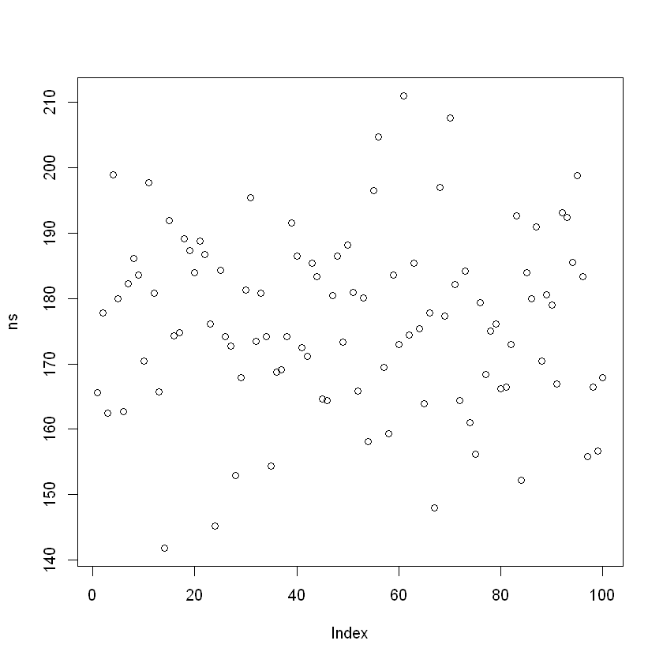
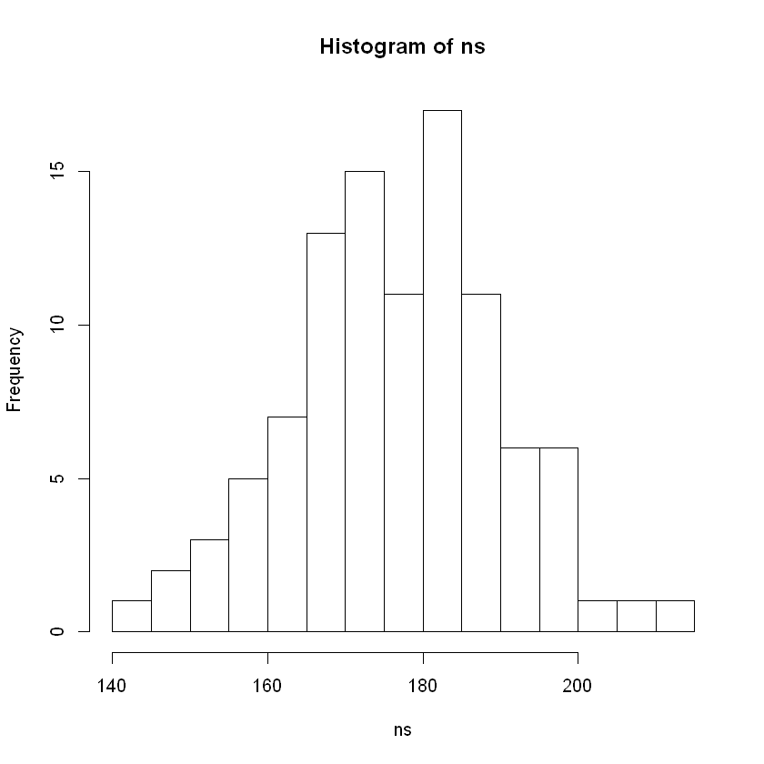
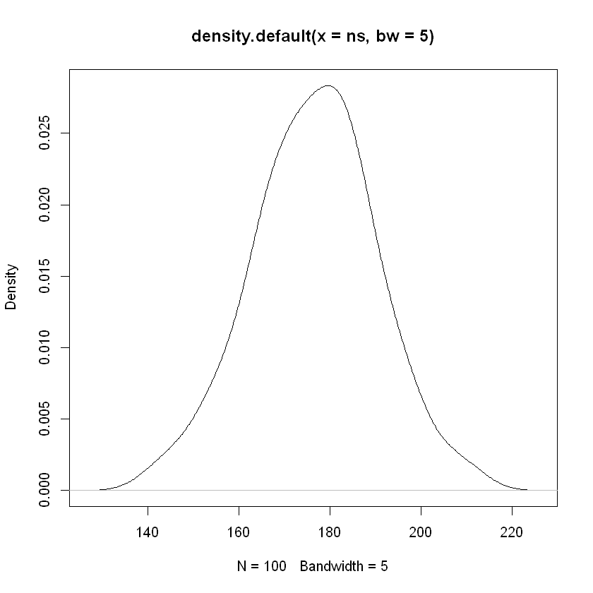
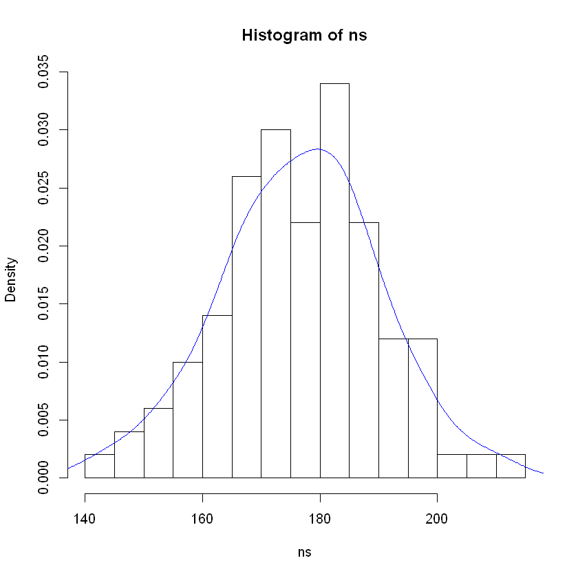
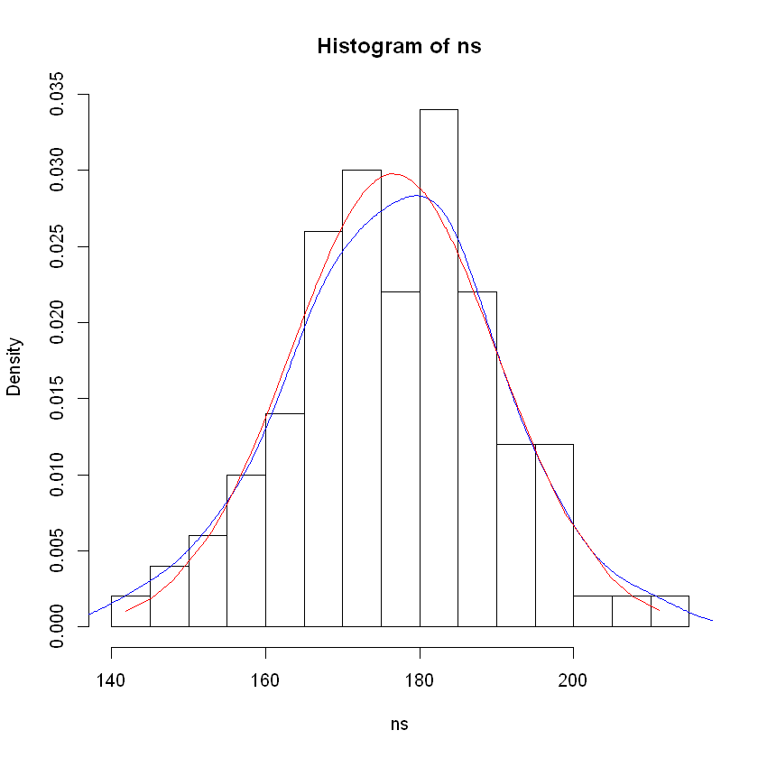
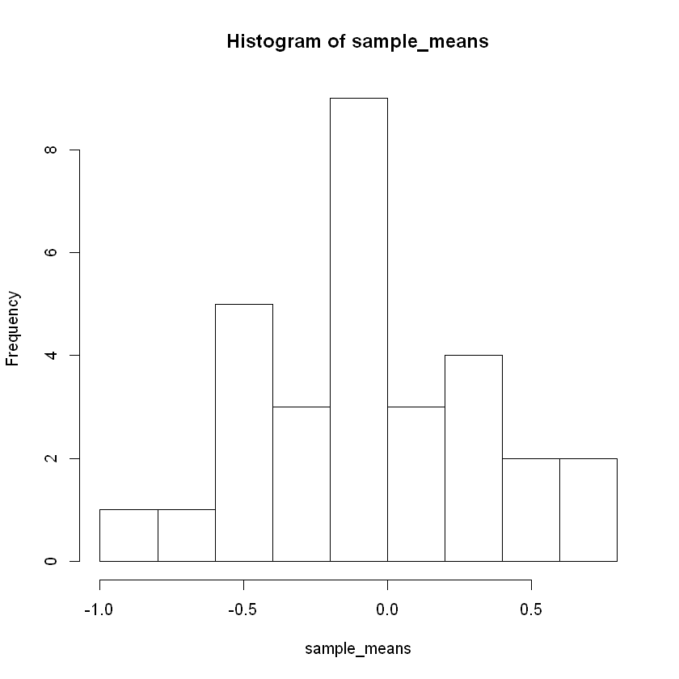
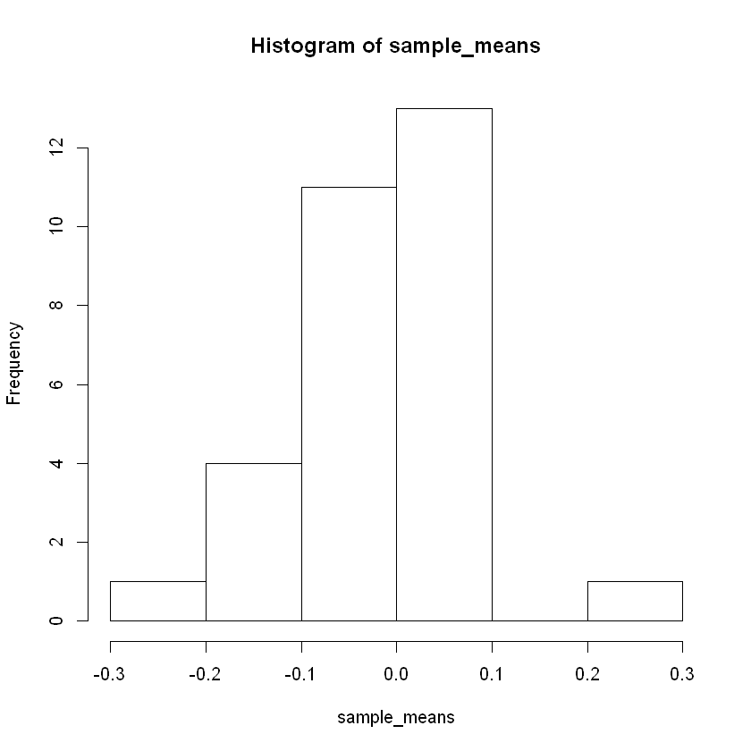
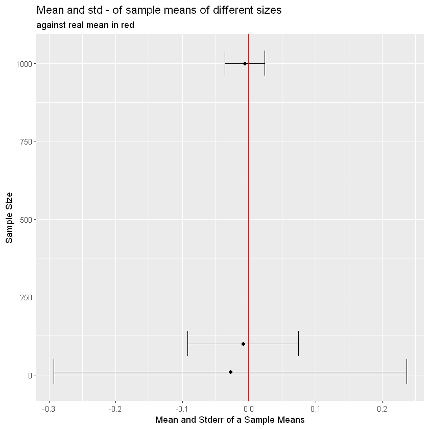

---
# "Normal Distribution and Interval Estimations"
---


```R
library(mlbench)
library(ggplot2)
```


```R
data(PimaIndiansDiabetes2)
df <- PimaIndiansDiabetes2
```

## Normal Distribution
### Generate Sample


```R
set.seed(1)

ns <- rnorm(n = 100, mean = 175, sd = 15)
ns
```


<ol class=list-inline>
	<li>165.603192838865</li>
	<li>177.754649863331</li>
	<li>162.465570813849</li>
	<li>198.929212032067</li>
	<li>179.94261657723</li>
	<li>162.69297423823</li>
	<li>182.311435786427</li>
	<li>186.074870576938</li>
	<li>183.636720274802</li>
	<li>170.419174192655</li>
	<li>197.676717526763</li>
	<li>180.847648546171</li>
	<li>165.681391291873</li>
	<li>141.779501692338</li>
	<li>191.873963772147</li>
	<li>174.325995864772</li>
	<li>174.757146053516</li>
	<li>189.157543160279</li>
	<li>187.318317926471</li>
	<li>183.908519818263</li>
	<li>188.784660574123</li>
	<li>186.732044510966</li>
	<li>176.118474750478</li>
	<li>145.159724562049</li>
	<li>184.297386218421</li>
	<li>174.158068907065</li>
	<li>172.66306739942</li>
	<li>152.938714241511</li>
	<li>167.827749173371</li>
	<li>181.269123402996</li>
	<li>195.380193272936</li>
	<li>173.458184089855</li>
	<li>180.815074173391</li>
	<li>174.192924391256</li>
	<li>154.344106647571</li>
	<li>168.775081550505</li>
	<li>169.085650694345</li>
	<li>174.110299049332</li>
	<li>191.500380579758</li>
	<li>186.447636226863</li>
	<li>172.532146056196</li>
	<li>171.199574797952</li>
	<li>185.454450631071</li>
	<li>183.349947980105</li>
	<li>164.668664581757</li>
	<li>164.387572645568</li>
	<li>180.468729432052</li>
	<li>186.527993867731</li>
	<li>173.314806817747</li>
	<li>188.216615896813</li>
	<li>180.971588205506</li>
	<li>165.819604101238</li>
	<li>180.116795371366</li>
	<li>158.059553558788</li>
	<li>196.495355525516</li>
	<li>204.705998477588</li>
	<li>169.491677853002</li>
	<li>159.337980605252</li>
	<li>183.545794411636</li>
	<li>172.974180941788</li>
	<li>211.024266407572</li>
	<li>174.411399959002</li>
	<li>185.346090436762</li>
	<li>175.42003238171</li>
	<li>163.850901866764</li>
	<li>177.831884492715</li>
	<li>147.925620566634</li>
	<li>196.983322923443</li>
	<li>177.298800073178</li>
	<li>207.589175055432</li>
	<li>182.132642933495</li>
	<li>164.350803536173</li>
	<li>184.160895302336</li>
	<li>160.988535525336</li>
	<li>156.195498996413</li>
	<li>179.371693532762</li>
	<li>168.350621901724</li>
	<li>175.016580274474</li>
	<li>176.115119862275</li>
	<li>166.157185807179</li>
	<li>166.469969007722</li>
	<li>172.972320773143</li>
	<li>192.671304948598</li>
	<li>152.146497993554</li>
	<li>183.909192814426</li>
	<li>179.994255568203</li>
	<li>190.946497559145</li>
	<li>170.437241145486</li>
	<li>180.550282148744</li>
	<li>179.006481861583</li>
	<li>166.862199535125</li>
	<li>193.118017089748</li>
	<li>192.406039235424</li>
	<li>185.503204742725</li>
	<li>198.802501818113</li>
	<li>183.37729638348</li>
	<li>155.851116873129</li>
	<li>166.401018786447</li>
	<li>156.630810776525</li>
	<li>167.89899045341</li>
</ol>


### Visual Check


```R
plot(ns)
```





```R
hist(ns, breaks = 20)
plot(density(ns, bw = 5))
```








```R
hist(ns, breaks = 20, freq = F)
lines(density(ns, bw = 5), col = "blue")
```





```R
mean(ns)
sd(ns)
n <- length(ns)
sd(ns) * sqrt(n - 1)/sqrt(n)

library(MASS)
fitdistr(ns, "normal")
```


176.63331050372


13.4729903949006


13.4054561831843


          mean           sd     
      176.6333105    13.4054562 
     (  1.3405456) (  0.9479089)


```R
hist(ns, breaks = 20, freq = F)
lines(density(ns, bw = 5), col = "blue")
lines(sort(ns), dnorm(sort(ns), mean = 176.6, sd = 13.4), col = "red")
```





### Formal Check


```R
shapiro.test(ns)
```


    
    	Shapiro-Wilk normality test
    
    data:  ns
    W = 0.9956, p-value = 0.9876
    


### Probabilities


```R
pnorm(q = 160, mean = 175, sd = 15)
pnorm(q = 160, mean = 175, sd = 15, lower.tail = F)
pnorm(q = 195, mean = 175, sd = 15, lower.tail = F)
pnorm(q = 195, mean = 175, sd = 15)

pnorm(q = 160, mean = 175, sd = 15) + pnorm(q = 195, mean = 175, sd = 15, lower.tail = F)

pnorm(q = 195, mean = 175, sd = 15) - pnorm(q = 160, mean = 175, sd = 15)

```


0.158655253931457


0.841344746068543


0.0912112197258678


0.908788780274132


0.249866473657325


0.750133526342675


### TASK #2.1 Sigma Rules
- Check 1-2-3 sigma rules for normal distribution


```R
n <- rnorm(10000)
std <- sd(n)
mn <- mean(n)

cat("\"1-2-3 sigma rules for normal distribution\"\n\n")
cat("In normal distribution :\n")

cat("\n\nIn 1 sigma:  ")
cat(paste(round((1 - (mean((n > (mn + 1 * std))) + mean((n < (mn - 1 * std))))) * 
    100, 1), "%"))

cat("\n\nIn 2 sigma:  ")
cat(paste(round((1 - (mean((n > (mn + 2 * std))) + mean((n < (mn - 2 * std))))) * 
    100, 1), "%"))

cat("\n\nIn 3 sigma:  ")
cat(paste(round((1 - (mean((n > (mn + 3 * std))) + mean((n < (mn - 3 * std))))) * 
    100, 1), "%"))
```

    "1-2-3 sigma rules for normal distribution"
    
    In normal distribution :
    
    
    In 1 sigma:  68.3 %
    
    In 2 sigma:  95.5 %
    
    In 3 sigma:  99.7 %


## Central Limit Theorem


```R
set.seed(8)
population <- rnorm(1e+06, 0, 1)
sample_10 <- sample(population, 10)
sample_50 <- sample(population, 50)
sample_100 <- sample(population, 100)

mean(sample_10)
mean(sample_50)
mean(sample_100)
```


-0.05881955683737


0.217904894579488


0.0584115512112759


```R
sample_means <- numeric(30)
set.seed(4)
for (i in 1:30) {
    sample_means[i] <- mean(sample(population, 10))
}
hist(sample_means)
```





```R
sample_means <- numeric(30)
set.seed(4)
for (i in 1:30) {
    sample_means[i] <- mean(sample(population, 100))
}
hist(sample_means)
```





### TASK #2.2 CLT
- Generate population (n = 1000000)
- Fix the size k for sample (k=10, k=100, k=1000)
- Sample k observations from the population for 50 times
- Calculate mean for each sample
- Then calculate mean and sd - of sample means
- Visualize for different k (for example, using faceting with common x-axis)
- Compare


```R
n <- rnorm(1e+06)
K <- c(10, 100, 1000)
means <- c()
stders <- c()

f <- function(s = s, k = k) mean(sample(s, k))

for (k in K) {
    s <- replicate(50, f(n, k))
    means <- c(means, mean(s))
    stders <- c(stders, sd(s))
}

df <- data.frame(sample_size = K, mean_and_stderr = means, stders = stders)


ggplot(df, aes(mean_and_stderr, sample_size)) + geom_point() + geom_errorbar(aes(xmin = means - 
    stders, xmax = means + stders)) + geom_vline(xintercept = mean(n), color = "red", 
    size = 0.4, show.legend = T) + ylab("Sample Size") + xlab("Mean and Stderr of a Sample Means") + 
    labs(title = "Mean and std - of sample means of different sizes", subtitle = "against real mean in red")
```





## Confidence Intervals


```R
SE <- function(x) {
    sd(x)/sqrt(length(x))
}

SE(sample_10)
SE(sample_50)
SE(sample_100)
```


0.369332410432801


0.128306252634937


0.0956355789863357


```R
qt((1 - 0.95)/2, df = 9)
mean(sample_10) - 2.262157 * SE(sample_10)
t.test(sample_10)
```


-2.2621571627982


-0.894307454424804


    
    	One Sample t-test
    
    data:  sample_10
    t = -0.15926, df = 9, p-value = 0.877
    alternative hypothesis: true mean is not equal to 0
    95 percent confidence interval:
     -0.8943075  0.7766684
    sample estimates:
      mean of x 
    -0.05881956 
    


```R
t.test(sample_100)$conf.int
```


<ol class=list-inline>
	<li>-0.131350185788193</li>
	<li>0.248173288210745</li>
</ol>


```R
paste(t.test(sample_100, conf.level = 0.99)$conf.int,collapse=" : ")
```


'-0.192766255348648 : 0.3095893577712'


### TASK #2.3 Statistical Report, part 2
- Create a function for CI output, format: [xx.xx%, xx.xx%]
- Add 95%-CI for your descriptive statistics as shown below
- Is's important to have CI after Mean itself


```R
data(PimaIndiansDiabetes2)
df <- PimaIndiansDiabetes2[c(2:8)]

calculate_sample_summary <- function(df) {
    
    notNAVal <- sapply(df, function(x) round(length(na.omit(x)), 2))
    NAVal <- round((dim(df)[[1]] - notNAVal), 2)
    meanVal <- sapply(df, function(x) round(mean(x, na.rm = T), 2))
    CIVal <- sapply(df, function(x) paste(round(t.test(x)$conf.int, 2), collapse = " : "))
    medianVal <- sapply(df, function(x) round(median(x, na.rm = T), 2))
    minVal <- sapply(df, function(x) round(min(x, na.rm = T), 2))
    maxVal <- sapply(df, function(x) round(max(x, na.rm = T), 2))
    Q1Val <- sapply(df, function(x) round(quantile(x, na.rm = T)[c(2)], 2))
    Q3Val <- sapply(df, function(x) round(quantile(x, na.rm = T)[c(4)], 2))
    StdVal <- sapply(df, function(x) round(sd(x, na.rm = T), 2))
    IQRVal <- round((Q3Val - Q1Val), 2)
    
    sample_summary <- data.frame(`N. Valid` = notNAVal, `N. Missing` = NAVal, Mean = meanVal, 
        `95% CI` = CIVal, Std = StdVal, Min = minVal, Q1 = Q1Val, Median = medianVal, 
        Q3 = Q3Val, Max = maxVal, IQR = IQRVal, check.names = FALSE)
    
    sample_summary <- t(sample_summary)
    return(sample_summary)
}
```


```R
calculate_sample_summary(df)
```


<table>
<thead><tr><th></th><th scope=col>glucose</th><th scope=col>pressure</th><th scope=col>triceps</th><th scope=col>insulin</th><th scope=col>mass</th><th scope=col>pedigree</th><th scope=col>age</th></tr></thead>
<tbody>
	<tr><th scope=row>N. Valid</th><td>763            </td><td>733            </td><td>541            </td><td>394            </td><td>757            </td><td>768            </td><td>768            </td></tr>
	<tr><th scope=row>N. Missing</th><td>  5            </td><td> 35            </td><td>227            </td><td>374            </td><td> 11            </td><td>  0            </td><td>  0            </td></tr>
	<tr><th scope=row>Mean</th><td>121.69         </td><td> 72.41         </td><td> 29.15         </td><td>155.55         </td><td> 32.46         </td><td>  0.47         </td><td> 33.24         </td></tr>
	<tr><th scope=row>95% CI</th><td>119.52 : 123.86</td><td>71.51 : 73.3   </td><td>28.27 : 30.04  </td><td>143.78 : 167.31</td><td>31.96 : 32.95  </td><td>0.45 : 0.5     </td><td>32.41 : 34.07  </td></tr>
	<tr><th scope=row>Std</th><td> 30.54         </td><td> 12.38         </td><td> 10.48         </td><td>118.78         </td><td>  6.92         </td><td>  0.33         </td><td> 11.76         </td></tr>
	<tr><th scope=row>Min</th><td>44.00          </td><td>24.00          </td><td> 7.00          </td><td>14.00          </td><td>18.20          </td><td> 0.08          </td><td>21.00          </td></tr>
	<tr><th scope=row>Q1</th><td>99.00          </td><td>64.00          </td><td>22.00          </td><td>76.25          </td><td>27.50          </td><td> 0.24          </td><td>24.00          </td></tr>
	<tr><th scope=row>Median</th><td>117.00         </td><td> 72.00         </td><td> 29.00         </td><td>125.00         </td><td> 32.30         </td><td>  0.37         </td><td> 29.00         </td></tr>
	<tr><th scope=row>Q3</th><td>141.00         </td><td> 80.00         </td><td> 36.00         </td><td>190.00         </td><td> 36.60         </td><td>  0.63         </td><td> 41.00         </td></tr>
	<tr><th scope=row>Max</th><td>199.00         </td><td>122.00         </td><td> 99.00         </td><td>846.00         </td><td> 67.10         </td><td>  2.42         </td><td> 81.00         </td></tr>
	<tr><th scope=row>IQR</th><td> 42.00         </td><td> 16.00         </td><td> 14.00         </td><td>113.75         </td><td>  9.10         </td><td>  0.39         </td><td> 17.00         </td></tr>
</tbody>
</table>


