---
# 4. Comparing Two Groups
---


```R
library(mlbench, warn.conflicts = FALSE)
library(dplyr, warn.conflicts = FALSE)
options(dplyr.summarise.inform = FALSE)
library(tidyr, warn.conflicts = FALSE)
library(ggplot2, warn.conflicts = FALSE)
library(MultinomialCI, warn.conflicts = FALSE)
```


```R
data(PimaIndiansDiabetes2)
df <- PimaIndiansDiabetes2
```

## Comparing Numericals
### Visual Check


```R
numericals <- names(df)[2:8]
for (param in numericals) {
    p <- ggplot(df, aes(x = get(param), fill = diabetes)) + 
    geom_density(alpha = 0.5) + 
    xlab(param) + theme_bw()
    print(p)
}
```

    Warning message:
    "Removed 5 rows containing non-finite values (stat_density)."Warning message:
    "Removed 35 rows containing non-finite values (stat_density)."


    
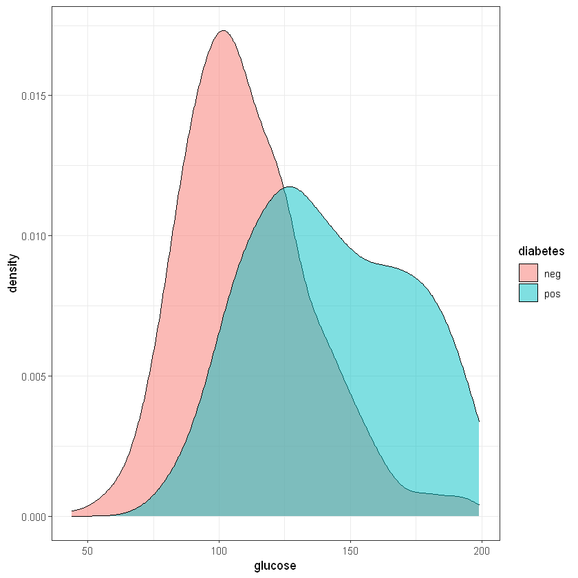
    


    Warning message:
    "Removed 227 rows containing non-finite values (stat_density)."


    
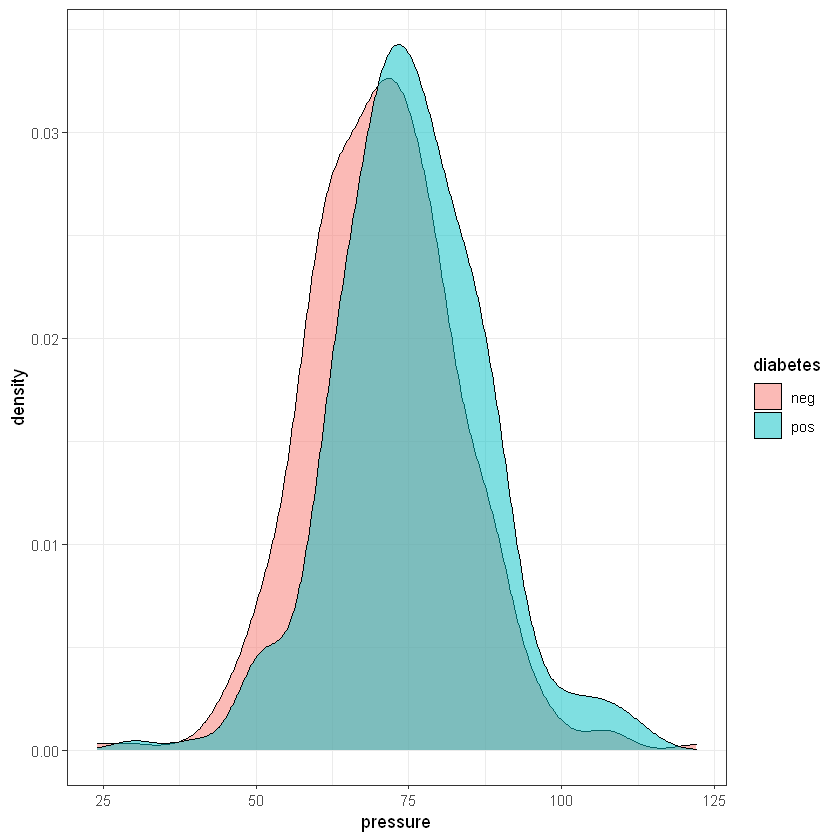
    


    Warning message:
    "Removed 374 rows containing non-finite values (stat_density)."


    
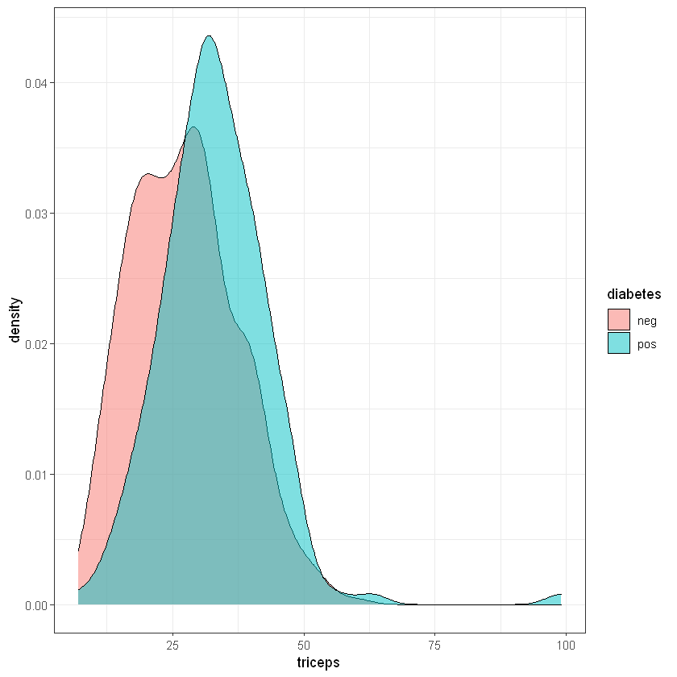
    


    Warning message:
    "Removed 11 rows containing non-finite values (stat_density)."


    
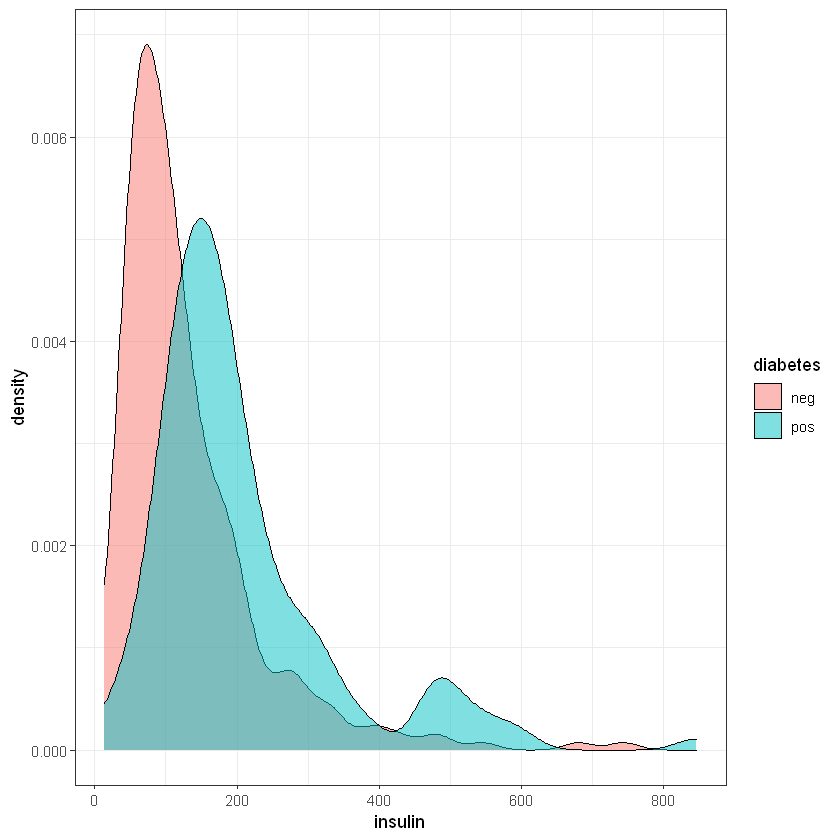
    


    
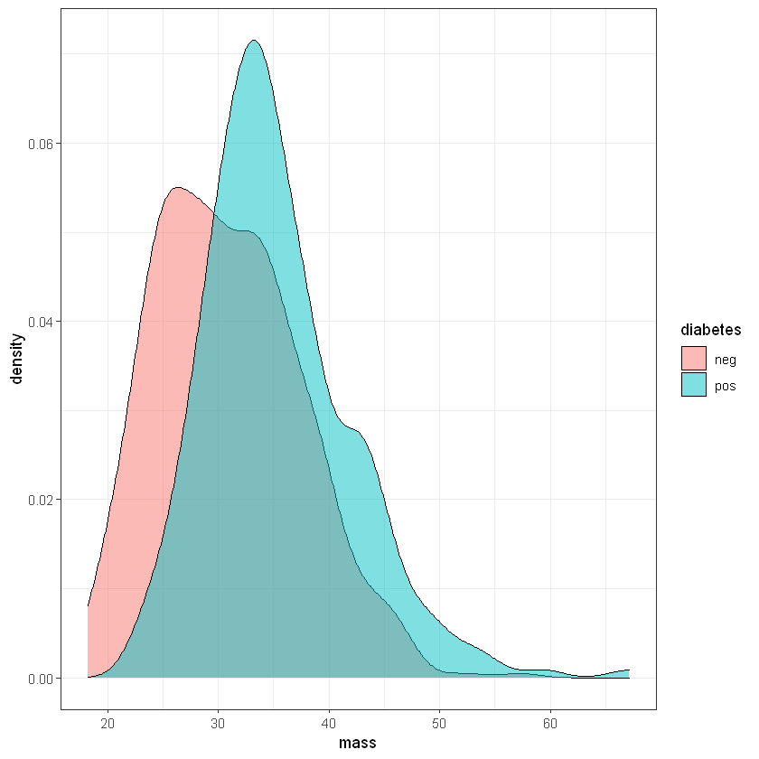
    


    
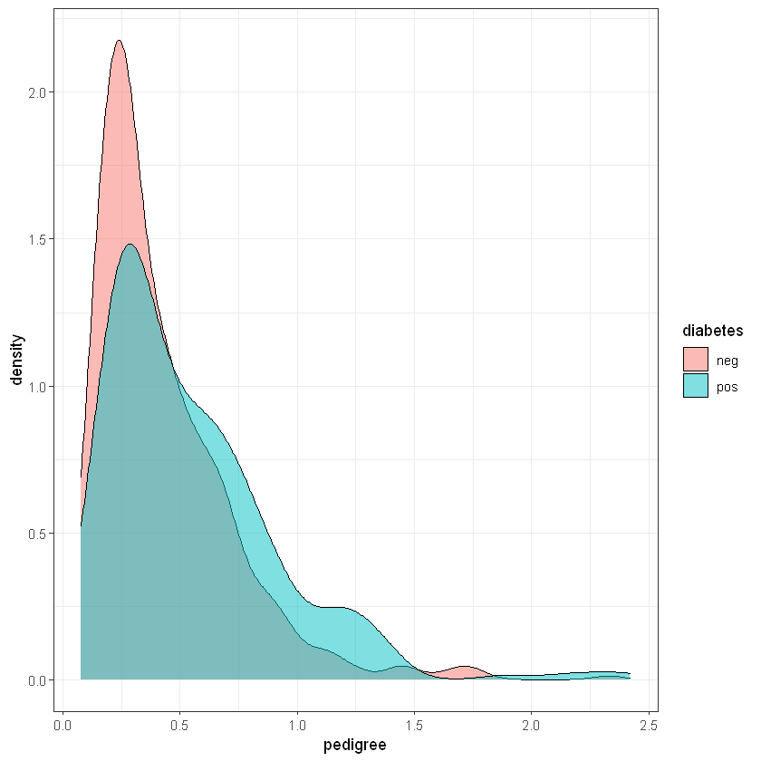
    


    
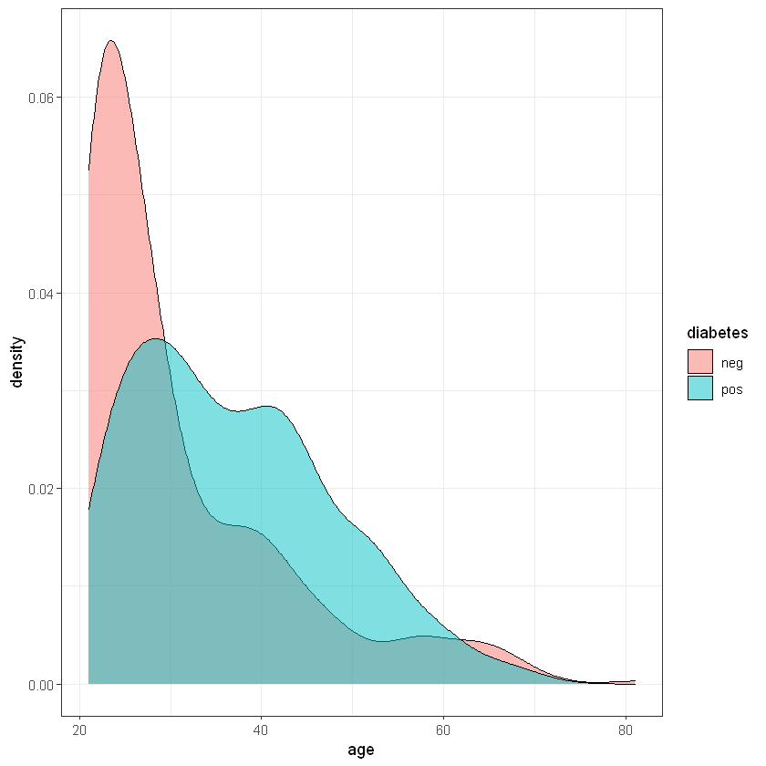
    


### Parametric: Student's t-Test


```R
# 1) check both samples for normal distribution 2) variances are homogeneous (if
# not - Welch modification) 3) perform 2-sample t-test

# Normality test
sh <- shapiro.test(df$pressure[df$diabetes == "neg"])
sh
sh <- shapiro.test(df$pressure[df$diabetes == "pos"])
sh

str(sh)

sh$method
round(sh$p.value, 4)
```


    
    	Shapiro-Wilk normality test
    
    data:  df$pressure[df$diabetes == "neg"]
    W = 0.98994, p-value = 0.002243
    


    
    	Shapiro-Wilk normality test
    
    data:  df$pressure[df$diabetes == "pos"]
    W = 0.98547, p-value = 0.01154
    


    List of 4
     $ statistic: Named num 0.985
      ..- attr(*, "names")= chr "W"
     $ p.value  : num 0.0115
     $ method   : chr "Shapiro-Wilk normality test"
     $ data.name: chr "df$pressure[df$diabetes == \"pos\"]"
     - attr(*, "class")= chr "htest"
    


'Shapiro-Wilk normality test'


0.0115


```R
# Fisher test for variances
var.test(pressure ~ diabetes, data = df)
```


    
    	F test to compare two variances
    
    data:  pressure by diabetes
    F = 0.97758, num df = 480, denom df = 251, p-value = 0.8279
    alternative hypothesis: true ratio of variances is not equal to 1
    95 percent confidence interval:
     0.7845145 1.2091557
    sample estimates:
    ratio of variances 
             0.9775832 
    


```R
# actually, we are not eligible to do so in given situation! but...  var.equal =
# FALSE
tt <- t.test(df$triceps[df$diabetes == "pos"], df$triceps[df$diabetes == "neg"])
tt

tt <- t.test(triceps ~ diabetes, data = df, var.equal = T)
tt

str(tt)
tt$method
round(tt$p.value, 4)
round(tt$estimate, 2)
tt$conf.int
```


    
    	Welch Two Sample t-test
    
    data:  df$triceps[df$diabetes == "pos"] and df$triceps[df$diabetes == "neg"]
    t = 6.1766, df = 348.51, p-value = 1.826e-09
    alternative hypothesis: true difference in means is not equal to 0
    95 percent confidence interval:
     3.928955 7.600131
    sample estimates:
    mean of x mean of y 
     33.00000  27.23546 
    


    
    	Two Sample t-test
    
    data:  triceps by diabetes
    t = -6.2381, df = 539, p-value = 8.96e-10
    alternative hypothesis: true difference in means is not equal to 0
    95 percent confidence interval:
     -7.579785 -3.949301
    sample estimates:
    mean in group neg mean in group pos 
             27.23546          33.00000 
    


    List of 10
     $ statistic  : Named num -6.24
      ..- attr(*, "names")= chr "t"
     $ parameter  : Named num 539
      ..- attr(*, "names")= chr "df"
     $ p.value    : num 8.96e-10
     $ conf.int   : num [1:2] -7.58 -3.95
      ..- attr(*, "conf.level")= num 0.95
     $ estimate   : Named num [1:2] 27.2 33
      ..- attr(*, "names")= chr [1:2] "mean in group neg" "mean in group pos"
     $ null.value : Named num 0
      ..- attr(*, "names")= chr "difference in means"
     $ stderr     : num 0.924
     $ alternative: chr "two.sided"
     $ method     : chr " Two Sample t-test"
     $ data.name  : chr "triceps by diabetes"
     - attr(*, "class")= chr "htest"
    


' Two Sample t-test'


0


<style>
.dl-inline {width: auto; margin:0; padding: 0}
.dl-inline>dt, .dl-inline>dd {float: none; width: auto; display: inline-block}
.dl-inline>dt::after {content: ":\0020"; padding-right: .5ex}
.dl-inline>dt:not(:first-of-type) {padding-left: .5ex}
</style><dl class=dl-inline><dt>mean in group neg</dt><dd>27.24</dd><dt>mean in group pos</dt><dd>33</dd></dl>


<style>
.list-inline {list-style: none; margin:0; padding: 0}
.list-inline>li {display: inline-block}
.list-inline>li:not(:last-child)::after {content: "\00b7"; padding: 0 .5ex}
</style>
<ol class=list-inline><li>-7.579784943499</li><li>-3.94930092907718</li></ol>


### Non-Parametric:  Wilcoxon test / Mann-Whitney test


```R
# actually, we should use this approach =)
mw <- wilcox.test(df$triceps[df$diabetes == "pos"], df$triceps[df$diabetes == "neg"])
mw

mw <- wilcox.test(triceps ~ diabetes, data = df)
mw

str(mw)
mw$method
round(mw$p.value, 4)
```


    
    	Wilcoxon rank sum test with continuity correction
    
    data:  df$triceps[df$diabetes == "pos"] and df$triceps[df$diabetes == "neg"]
    W = 43050, p-value = 6.961e-10
    alternative hypothesis: true location shift is not equal to 0
    


    
    	Wilcoxon rank sum test with continuity correction
    
    data:  triceps by diabetes
    W = 21930, p-value = 6.961e-10
    alternative hypothesis: true location shift is not equal to 0
    


    List of 7
     $ statistic  : Named num 21930
      ..- attr(*, "names")= chr "W"
     $ parameter  : NULL
     $ p.value    : num 6.96e-10
     $ null.value : Named num 0
      ..- attr(*, "names")= chr "location shift"
     $ alternative: chr "two.sided"
     $ method     : chr "Wilcoxon rank sum test with continuity correction"
     $ data.name  : chr "triceps by diabetes"
     - attr(*, "class")= chr "htest"
    


'Wilcoxon rank sum test with continuity correction'


0


### Paired Tests


```R
# t.test(..., paired = FALSE -> paired = TRUE)
# wilcox.test(..., paired = FALSE -> paired = TRUE)
```

## Comparing Categoricals


```R
df$bmi <- as.factor(ifelse(df$mass < 25, "Normal", "Abnormal"))
ct <- chisq.test(df$bmi, df$diabete)
ct

str(ct)
ct$method
ct$p.value


ft <- fisher.test(df$bmi, df$diabete)
ft
str(ft)
ft$method
ft$p.value
ft$estimate
ft$conf.int
```


    
    	Pearson's Chi-squared test with Yates' continuity correction
    
    data:  df$bmi and df$diabete
    X-squared = 42.592, df = 1, p-value = 6.745e-11
    


    List of 9
     $ statistic: Named num 42.6
      ..- attr(*, "names")= chr "X-squared"
     $ parameter: Named int 1
      ..- attr(*, "names")= chr "df"
     $ p.value  : num 6.74e-11
     $ method   : chr "Pearson's Chi-squared test with Yates' continuity correction"
     $ data.name: chr "df$bmi and df$diabete"
     $ observed : 'table' int [1:2, 1:2] 392 99 259 7
      ..- attr(*, "dimnames")=List of 2
      .. ..$ df$bmi    : chr [1:2] "Abnormal" "Normal"
      .. ..$ df$diabete: chr [1:2] "neg" "pos"
     $ expected : num [1:2, 1:2] 422.2 68.8 228.8 37.2
      ..- attr(*, "dimnames")=List of 2
      .. ..$ df$bmi    : chr [1:2] "Abnormal" "Normal"
      .. ..$ df$diabete: chr [1:2] "neg" "pos"
     $ residuals: 'table' num [1:2, 1:2] -1.47 3.65 2 -4.96
      ..- attr(*, "dimnames")=List of 2
      .. ..$ df$bmi    : chr [1:2] "Abnormal" "Normal"
      .. ..$ df$diabete: chr [1:2] "neg" "pos"
     $ stdres   : 'table' num [1:2, 1:2] -6.64 6.64 6.64 -6.64
      ..- attr(*, "dimnames")=List of 2
      .. ..$ df$bmi    : chr [1:2] "Abnormal" "Normal"
      .. ..$ df$diabete: chr [1:2] "neg" "pos"
     - attr(*, "class")= chr "htest"
    


'Pearson\'s Chi-squared test with Yates\' continuity correction'


6.74455167643922e-11


    
    	Fisher's Exact Test for Count Data
    
    data:  df$bmi and df$diabete
    p-value = 3.322e-13
    alternative hypothesis: true odds ratio is not equal to 1
    95 percent confidence interval:
     0.04137552 0.23436448
    sample estimates:
    odds ratio 
     0.1072507 
    


    List of 7
     $ p.value    : num 3.32e-13
     $ conf.int   : num [1:2] 0.0414 0.2344
      ..- attr(*, "conf.level")= num 0.95
     $ estimate   : Named num 0.107
      ..- attr(*, "names")= chr "odds ratio"
     $ null.value : Named num 1
      ..- attr(*, "names")= chr "odds ratio"
     $ alternative: chr "two.sided"
     $ method     : chr "Fisher's Exact Test for Count Data"
     $ data.name  : chr "df$bmi and df$diabete"
     - attr(*, "class")= chr "htest"
    


'Fisher\'s Exact Test for Count Data'


3.32237037784986e-13


<strong>odds ratio:</strong> 0.107250697203038


<style>
.list-inline {list-style: none; margin:0; padding: 0}
.list-inline>li {display: inline-block}
.list-inline>li:not(:last-child)::after {content: "\00b7"; padding: 0 .5ex}
</style>
<ol class=list-inline><li>0.0413755182519714</li><li>0.23436447722542</li></ol>


### Paired tests


```R
# mcnemar.test() # 2x2
```

## TASK #4.1 Statistical Report with Tests Results
- Take any data set you like, containing 2 groups of observation (balance by size) ✔
- Create report for numerical data with appropriate tests (description of 2 groups, comparing them)
- Create report for categorical data with appropriate tests (description of 2 groups, comparing them)
- When comparing you should put name of method and p-value
### Example will be attached later


```R
data("iris")
df <- iris
```


```R
df <- df[df$Species %in% c('setosa', 'virginica'), ]
df$Species <- as.factor(as.vector(df$Species))
df$Cool.Flower <- df$Sepal.Width > mean(df$Sepal.Width)
df$Cool.Flower <- factor(as.vector(df$Cool.Flower), labels =c('Depressive', 'Cool'))
```


```R
table(df$Species)
```


    
       setosa virginica 
           50        50 


```R
head(df) %>%
    knitr::kable()
```


    
    
    | Sepal.Length| Sepal.Width| Petal.Length| Petal.Width|Species |Cool.Flower |
    |------------:|-----------:|------------:|-----------:|:-------|:-----------|
    |          5.1|         3.5|          1.4|         0.2|setosa  |Cool        |
    |          4.9|         3.0|          1.4|         0.2|setosa  |Depressive  |
    |          4.7|         3.2|          1.3|         0.2|setosa  |Depressive  |
    |          4.6|         3.1|          1.5|         0.2|setosa  |Depressive  |
    |          5.0|         3.6|          1.4|         0.2|setosa  |Cool        |
    |          5.4|         3.9|          1.7|         0.4|setosa  |Cool        |


```R
# checking variances visually
numericals <- names(df)[1:4]
for (param in numericals) {
    p <- ggplot(df, aes(x = get(param), fill = Species)) + 
    geom_density(alpha = 0.5) + 
    xlab(param) + theme_bw()
    print(p)
}
```


    
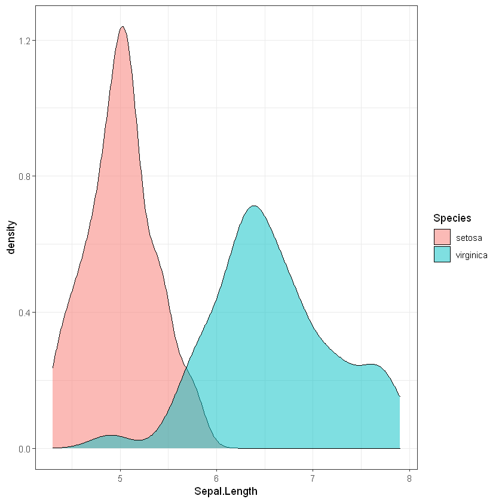
    


    
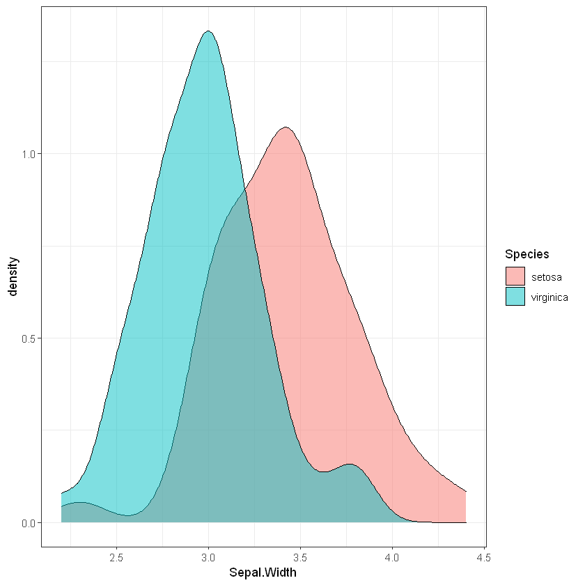
    


    
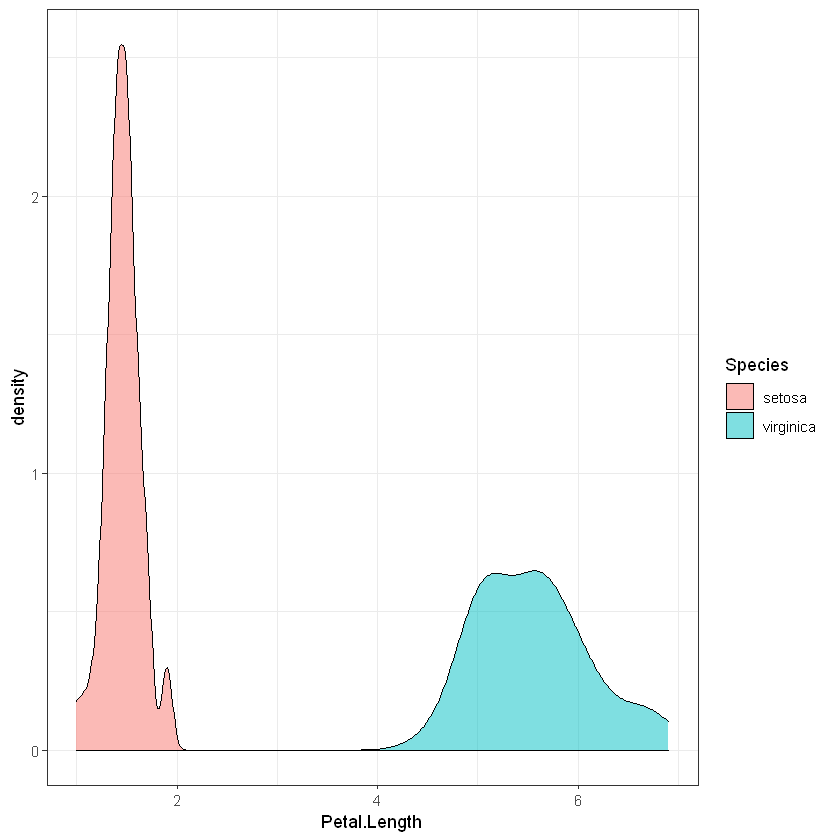
    


    
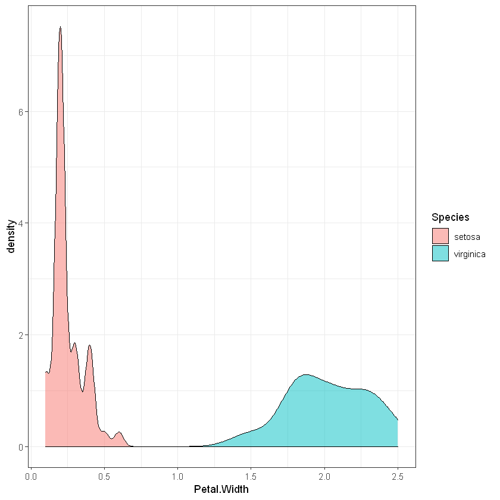
    


```R
# checking variances and means
df[1:5] %>% 
    gather(key = 'Parameter', value = 'Value', -Species) %>% 
    group_by(Species, Parameter) %>% 
    summarize(mean = mean(Value, na.rm = T),
            var = var(Value, na.rm = T)) %>%  
    gather(key = 'Measure', value = 'Value', -c(Species, Parameter))  %>%  
    spread(key = Species, value = Value)
```


<table class="dataframe">
<caption>A tibble: 8 × 4</caption>
<thead>
	<tr><th scope=col>Parameter</th><th scope=col>Measure</th><th scope=col>setosa</th><th scope=col>virginica</th></tr>
	<tr><th scope=col>&lt;chr&gt;</th><th scope=col>&lt;chr&gt;</th><th scope=col>&lt;dbl&gt;</th><th scope=col>&lt;dbl&gt;</th></tr>
</thead>
<tbody>
	<tr><td>Petal.Length</td><td>mean</td><td>1.46200000</td><td>5.55200000</td></tr>
	<tr><td>Petal.Length</td><td>var </td><td>0.03015918</td><td>0.30458776</td></tr>
	<tr><td>Petal.Width </td><td>mean</td><td>0.24600000</td><td>2.02600000</td></tr>
	<tr><td>Petal.Width </td><td>var </td><td>0.01110612</td><td>0.07543265</td></tr>
	<tr><td>Sepal.Length</td><td>mean</td><td>5.00600000</td><td>6.58800000</td></tr>
	<tr><td>Sepal.Length</td><td>var </td><td>0.12424898</td><td>0.40434286</td></tr>
	<tr><td>Sepal.Width </td><td>mean</td><td>3.42800000</td><td>2.97400000</td></tr>
	<tr><td>Sepal.Width </td><td>var </td><td>0.14368980</td><td>0.10400408</td></tr>
</tbody>
</table>


```R
cats <- fisher.test(df$Cool.Flower, df$Species)

pvals <- as.vector(sapply(df[1:4], function(x) t.test(x ~ Species, data = df[1:5], var.equal = F)$p.value))
pvals <- c(pvals, as.vector(sapply(df[1:4], function(x) var.test(x ~ Species, data = df[1:5])$p.value)))
pvals <- c(pvals, cats$p.value)
pvals <- as.character(signif(pvals, 3))

methods <- as.vector(sapply(df[1:4], function(x) t.test(x ~ Species, data = df[1:5], var.equal = F)$method))
methods <- c(methods, as.vector(sapply(df[1:4], function(x) var.test(x ~ Species, data = df[1:5])$method)))
methods <- c(methods, cats$method)

features <- names(df[1:4])
features <- c(features, names(df[1:4]))
features <- c(features, "Cool.Flower")
                            
data.frame(`feature by Species` = features, p.value = pvals, method = methods) %>% knitr::kable()
```


    
    
    |feature.by.Species |p.value  |method                             |
    |:------------------|:--------|:----------------------------------|
    |Sepal.Length       |3.97e-25 |Welch Two Sample t-test            |
    |Sepal.Width        |4.57e-09 |Welch Two Sample t-test            |
    |Petal.Length       |9.27e-50 |Welch Two Sample t-test            |
    |Petal.Width        |2.44e-48 |Welch Two Sample t-test            |
    |Sepal.Length       |6.37e-05 |F test to compare two variances    |
    |Sepal.Width        |0.261    |F test to compare two variances    |
    |Petal.Length       |1.87e-13 |F test to compare two variances    |
    |Petal.Width        |4.17e-10 |F test to compare two variances    |
    |Cool.Flower        |5.78e-07 |Fisher's Exact Test for Count Data |

