```R
options(repr.plot.width = 5, repr.plot.height = 5)
```


```R
library(dplyr, warn.conflicts = FALSE)
options(dplyr.summarise.inform = FALSE)
library(tidyr, warn.conflicts = FALSE)
library(ggplot2, warn.conflicts = FALSE)
```

    Warning message:
    "package 'dplyr' was built under R version 3.6.3"Warning message:
    "package 'tidyr' was built under R version 3.6.3"Warning message:
    "package 'ggplot2' was built under R version 3.6.3"

- Anscombe’s data set:
   -  Scatter plot facetted by set ✔
   -  Summary calculation (mean, sd) grouped by set ✔
   -  Pearson’s correlation by set, and non-parametric, and p-values ✔
   -  Add *geom_smooth()* to the plot ✔
- Other data set: [Air+quality](https://archive.ics.uci.edu/ml/datasets/Air+quality)
   -  Explore data set, clean if needed ✔
   -  Explore each variable independently ✔
   -  Cross correlations ✔(?)
   -  Build simple linear models with each predictor, check assumptions ✔
   -  For one of the models create train-test sets, plot the model, for the test set color
      real and predicted points differently; R^2 and p-value to title ✔

## Anscombe


```R
data(anscombe)
df <- anscombe
```


```R
df %>% knitr::kable()
```


    
    
    | x1| x2| x3| x4|    y1|   y2|    y3|    y4|
    |--:|--:|--:|--:|-----:|----:|-----:|-----:|
    | 10| 10| 10|  8|  8.04| 9.14|  7.46|  6.58|
    |  8|  8|  8|  8|  6.95| 8.14|  6.77|  5.76|
    | 13| 13| 13|  8|  7.58| 8.74| 12.74|  7.71|
    |  9|  9|  9|  8|  8.81| 8.77|  7.11|  8.84|
    | 11| 11| 11|  8|  8.33| 9.26|  7.81|  8.47|
    | 14| 14| 14|  8|  9.96| 8.10|  8.84|  7.04|
    |  6|  6|  6|  8|  7.24| 6.13|  6.08|  5.25|
    |  4|  4|  4| 19|  4.26| 3.10|  5.39| 12.50|
    | 12| 12| 12|  8| 10.84| 9.13|  8.15|  5.56|
    |  7|  7|  7|  8|  4.82| 7.26|  6.42|  7.91|
    |  5|  5|  5|  8|  5.68| 4.74|  5.73|  6.89|


```R
X = gather(df[1:4])
Y = gather(df[5:8])
XY = paste(X$key, Y$key)
long = data.frame(X=X$value, Y=Y$value, XY = XY)
head(long) %>% knitr::kable()
```


    
    
    |  X|    Y|XY    |
    |--:|----:|:-----|
    | 10| 8.04|x1 y1 |
    |  8| 6.95|x1 y1 |
    | 13| 7.58|x1 y1 |
    |  9| 8.81|x1 y1 |
    | 11| 8.33|x1 y1 |
    | 14| 9.96|x1 y1 |


```R
p <- ggplot(long, aes(X, Y)) + 
  geom_point() +
  geom_smooth(orientation = "x", method="lm", fullrange = T)

p + facet_wrap(~XY, ncol = 2)
```

    `geom_smooth()` using formula 'y ~ x'
    


    

    


```R
order_cat <- c("meanX", "meanY", 'sdX','sdY', 'corPearson','corKendall', 'corSpearman','corPval')

longSummary <- long %>% 
    group_by(XY) %>% 
    summarize(meanX = round(mean(X, na.rm = T), 2),
              sdX = round(sd(X, na.rm = T), 2),
              meanY = round(mean(Y, na.rm = T), 2),
              sdY = round(sd(X, na.rm = T), 2),
              corPearson = round(cor(X, Y, method = "pearson"), 2),
              corKendall = round(cor(X, Y, method = "kendall"), 2),
              corSpearman = round(cor(X, Y, method = "spearman"), 2),
              corPvalXY = signif(cor.test(X, Y)$p.value, 1)) %>%  
    gather(key = 'Poperty', value = 'Value', -c(XY))  %>%  
    spread(key = XY, value = Value) %>% 
    arrange(match(Poperty, order_cat))

longSummary %>% knitr::kable()
```


    
    
    |Poperty     | x1 y1| x2 y2| x3 y3| x4 y4|
    |:-----------|-----:|-----:|-----:|-----:|
    |meanX       | 9.000| 9.000| 9.000| 9.000|
    |meanY       | 7.500| 7.500| 7.500| 7.500|
    |sdX         | 3.320| 3.320| 3.320| 3.320|
    |sdY         | 3.320| 3.320| 3.320| 3.320|
    |corPearson  | 0.820| 0.820| 0.820| 0.820|
    |corKendall  | 0.640| 0.560| 0.960| 0.430|
    |corSpearman | 0.820| 0.690| 0.990| 0.500|
    |corPvalXY   | 0.002| 0.002| 0.002| 0.002|


## Air+quality from UCI

```
The dataset contains 9358 instances of hourly averaged responses from an array of 5 metal oxide chemical sensors embedded in an Air Quality Chemical Multisensor Device. The device was located on the field in a significantly polluted area, at road level,within an Italian city. Data were recorded from March 2004 to February 2005 (one year)representing the longest freely available recordings of on field deployed air quality chemical sensor devices responses. Ground Truth hourly averaged concentrations for CO, Non Metanic Hydrocarbons, Benzene, Total Nitrogen Oxides (NOx) and Nitrogen Dioxide (NO2) and were provided by a co-located reference certified analyzer. Evidences of cross-sensitivities as well as both concept and sensor drifts are present as described in De Vito et al., Sens. And Act. B, Vol. 129,2,2008 (citation required) eventually affecting sensors concentration estimation capabilities. *Missing values are tagged with -200 value.*
This dataset can be used exclusively for research purposes. Commercial purposes are fully excluded.

Attribute Information:

0 Date (DD/MM/YYYY)
1 Time (HH.MM.SS)
2 True hourly averaged concentration CO in mg/m^3 (reference analyzer)
3 PT08.S1 (tin oxide) hourly averaged sensor response (nominally CO targeted)
4 True hourly averaged overall Non Metanic HydroCarbons concentration in microg/m^3 (reference analyzer)
5 True hourly averaged Benzene concentration in microg/m^3 (reference analyzer)
6 PT08.S2 (titania) hourly averaged sensor response (nominally NMHC targeted)
7 True hourly averaged NOx concentration in ppb (reference analyzer)
8 PT08.S3 (tungsten oxide) hourly averaged sensor response (nominally NOx targeted)
9 True hourly averaged NO2 concentration in microg/m^3 (reference analyzer)
10 PT08.S4 (tungsten oxide) hourly averaged sensor response (nominally NO2 targeted)
11 PT08.S5 (indium oxide) hourly averaged sensor response (nominally O3 targeted)
12 Temperature in °C
13 Relative Humidity (%)
14 AH Absolute Humidity 
```


```R
URL = "https://archive.ics.uci.edu/ml/machine-learning-databases/00360/AirQualityUCI.zip"
temp <- tempfile()
download.file(URL, temp)
df <- read.table(unz(temp, "AirQualityUCI.csv"), sep = ";", header = T, dec = ",")
unlink(temp)
dim(df)
```


<ol class=list-inline>
	<li>9471</li>
	<li>17</li>
</ol>


```R
head(df[1:8]) %>% knitr::kable()
```


    
    
    |Date       |Time     | CO.GT.| PT08.S1.CO.| NMHC.GT.| C6H6.GT.| PT08.S2.NMHC.| NOx.GT.|
    |:----------|:--------|------:|-----------:|--------:|--------:|-------------:|-------:|
    |10/03/2004 |18.00.00 |    2.6|        1360|      150|     11.9|          1046|     166|
    |10/03/2004 |19.00.00 |    2.0|        1292|      112|      9.4|           955|     103|
    |10/03/2004 |20.00.00 |    2.2|        1402|       88|      9.0|           939|     131|
    |10/03/2004 |21.00.00 |    2.2|        1376|       80|      9.2|           948|     172|
    |10/03/2004 |22.00.00 |    1.6|        1272|       51|      6.5|           836|     131|
    |10/03/2004 |23.00.00 |    1.2|        1197|       38|      4.7|           750|      89|


```R
tail(df[1:8]) %>% knitr::kable()
```


    
    
    |     |Date |Time | CO.GT.| PT08.S1.CO.| NMHC.GT.| C6H6.GT.| PT08.S2.NMHC.| NOx.GT.|
    |:----|:----|:----|------:|-----------:|--------:|--------:|-------------:|-------:|
    |9466 |     |     |     NA|          NA|       NA|       NA|            NA|      NA|
    |9467 |     |     |     NA|          NA|       NA|       NA|            NA|      NA|
    |9468 |     |     |     NA|          NA|       NA|       NA|            NA|      NA|
    |9469 |     |     |     NA|          NA|       NA|       NA|            NA|      NA|
    |9470 |     |     |     NA|          NA|       NA|       NA|            NA|      NA|
    |9471 |     |     |     NA|          NA|       NA|       NA|            NA|      NA|


```R
# delete two last empty columns and all empty rows from the tail
df <- na.omit(df[, -c(16, 17)])
```


```R
# fill missing values, coded with '-200' with mean
df[df == -200] <- NA

# let's use function from the previous exersice to find almost empty column
calculate_sample_summary <- function(df) {
    
    notNAVal <- sapply(df, function(x) round(length(na.omit(x)), 2))
    NAVal <- round((dim(df)[[1]] - notNAVal), 2)
    meanVal <- sapply(df, function(x) round(mean(x, na.rm = T), 2))
    CIVal <- sapply(df, function(x) paste(round(t.test(x)$conf.int, 2), collapse = " : "))
    medianVal <- sapply(df, function(x) round(median(x, na.rm = T), 2))
    minVal <- sapply(df, function(x) round(min(x, na.rm = T), 2))
    maxVal <- sapply(df, function(x) round(max(x, na.rm = T), 2))
    Q1Val <- sapply(df, function(x) round(quantile(x, na.rm = T)[c(2)], 2))
    Q3Val <- sapply(df, function(x) round(quantile(x, na.rm = T)[c(4)], 2))
    StdVal <- sapply(df, function(x) round(sd(x, na.rm = T), 2))
    IQRVal <- round((Q3Val - Q1Val), 2)
    
    sample_summary <- data.frame(`N. Valid` = notNAVal, `N. Missing` = NAVal, Mean = meanVal, 
        `95% CI` = CIVal, Std = StdVal, Min = minVal, Q1 = Q1Val, Median = medianVal, 
        Q3 = Q3Val, Max = maxVal, IQR = IQRVal, check.names = FALSE)
    
    sample_summary <- t(sample_summary)
    return(sample_summary)
}

calculate_sample_summary(df[3:15])
```


<table>
<thead><tr><th></th><th scope=col>CO.GT.</th><th scope=col>PT08.S1.CO.</th><th scope=col>NMHC.GT.</th><th scope=col>C6H6.GT.</th><th scope=col>PT08.S2.NMHC.</th><th scope=col>NOx.GT.</th><th scope=col>PT08.S3.NOx.</th><th scope=col>NO2.GT.</th><th scope=col>PT08.S4.NO2.</th><th scope=col>PT08.S5.O3.</th><th scope=col>T</th><th scope=col>RH</th><th scope=col>AH</th></tr></thead>
<tbody>
	<tr><th scope=row>N. Valid</th><td>7674             </td><td>8991             </td><td> 914             </td><td>8991             </td><td>8991             </td><td>7718             </td><td>8991             </td><td>7715             </td><td>8991             </td><td>8991             </td><td>8991             </td><td>8991             </td><td>8991             </td></tr>
	<tr><th scope=row>N. Missing</th><td>1683             </td><td> 366             </td><td>8443             </td><td> 366             </td><td> 366             </td><td>1639             </td><td> 366             </td><td>1642             </td><td> 366             </td><td> 366             </td><td> 366             </td><td> 366             </td><td> 366             </td></tr>
	<tr><th scope=row>Mean</th><td>   2.15          </td><td>1099.83          </td><td> 218.81          </td><td>  10.08          </td><td> 939.15          </td><td> 246.90          </td><td> 835.49          </td><td> 113.09          </td><td>1456.26          </td><td>1022.91          </td><td>  18.32          </td><td>  49.23          </td><td>   1.03          </td></tr>
	<tr><th scope=row>95% CI</th><td>2.12 : 2.19      </td><td>1095.35 : 1104.32</td><td>205.54 : 232.08  </td><td>9.93 : 10.24     </td><td>933.64 : 944.67  </td><td>242.14 : 251.65  </td><td>830.18 : 840.8   </td><td>112.01 : 114.17  </td><td>1449.11 : 1463.42</td><td>1014.67 : 1031.14</td><td>18.14 : 18.5     </td><td>48.88 : 49.59    </td><td>1.02 : 1.03      </td></tr>
	<tr><th scope=row>Std</th><td>  1.45           </td><td>217.08           </td><td>204.46           </td><td>  7.45           </td><td>266.83           </td><td>212.98           </td><td>256.82           </td><td> 48.37           </td><td>346.21           </td><td>398.48           </td><td>  8.83           </td><td> 17.32           </td><td>  0.40           </td></tr>
	<tr><th scope=row>Min</th><td>  0.10           </td><td>647.00           </td><td>  7.00           </td><td>  0.10           </td><td>383.00           </td><td>  2.00           </td><td>322.00           </td><td>  2.00           </td><td>551.00           </td><td>221.00           </td><td> -1.90           </td><td>  9.20           </td><td>  0.18           </td></tr>
	<tr><th scope=row>Q1</th><td>   1.10          </td><td> 937.00          </td><td>  67.00          </td><td>   4.40          </td><td> 734.50          </td><td>  98.00          </td><td> 658.00          </td><td>  78.00          </td><td>1227.00          </td><td> 731.50          </td><td>  11.80          </td><td>  35.80          </td><td>   0.74          </td></tr>
	<tr><th scope=row>Median</th><td>   1.8           </td><td>1063.0           </td><td> 150.0           </td><td>   8.2           </td><td> 909.0           </td><td> 180.0           </td><td> 806.0           </td><td> 109.0           </td><td>1463.0           </td><td> 963.0           </td><td>  17.8           </td><td>  49.6           </td><td>   1.0           </td></tr>
	<tr><th scope=row>Q3</th><td>   2.90          </td><td>1231.00          </td><td> 297.00          </td><td>  14.00          </td><td>1116.00          </td><td> 326.00          </td><td> 969.50          </td><td> 142.00          </td><td>1674.00          </td><td>1273.50          </td><td>  24.40          </td><td>  62.50          </td><td>   1.31          </td></tr>
	<tr><th scope=row>Max</th><td>  11.90          </td><td>2040.00          </td><td>1189.00          </td><td>  63.70          </td><td>2214.00          </td><td>1479.00          </td><td>2683.00          </td><td> 340.00          </td><td>2775.00          </td><td>2523.00          </td><td>  44.60          </td><td>  88.70          </td><td>   2.23          </td></tr>
	<tr><th scope=row>IQR</th><td>  1.80           </td><td>294.00           </td><td>230.00           </td><td>  9.60           </td><td>381.50           </td><td>228.00           </td><td>311.50           </td><td> 64.00           </td><td>447.00           </td><td>542.00           </td><td> 12.60           </td><td> 26.70           </td><td>  0.57           </td></tr>
</tbody>
</table>


```R
# let's drop 4 columns with major population of missing values
df <- df[!(colnames(df) %in% c('CO.GT.','NMHC.GT.', 'NOx.GT.', 'NO2.GT.'))]
```


```R
# whera are pathes of missing values -> drop rows
df[8075:8100, 3:11]
```


<table>
<thead><tr><th></th><th scope=col>PT08.S1.CO.</th><th scope=col>C6H6.GT.</th><th scope=col>PT08.S2.NMHC.</th><th scope=col>PT08.S3.NOx.</th><th scope=col>PT08.S4.NO2.</th><th scope=col>PT08.S5.O3.</th><th scope=col>T</th><th scope=col>RH</th><th scope=col>AH</th></tr></thead>
<tbody>
	<tr><th scope=row>8075</th><td>NA</td><td>NA</td><td>NA</td><td>NA</td><td>NA</td><td>NA</td><td>NA</td><td>NA</td><td>NA</td></tr>
	<tr><th scope=row>8076</th><td>NA</td><td>NA</td><td>NA</td><td>NA</td><td>NA</td><td>NA</td><td>NA</td><td>NA</td><td>NA</td></tr>
	<tr><th scope=row>8077</th><td>NA</td><td>NA</td><td>NA</td><td>NA</td><td>NA</td><td>NA</td><td>NA</td><td>NA</td><td>NA</td></tr>
	<tr><th scope=row>8078</th><td>NA</td><td>NA</td><td>NA</td><td>NA</td><td>NA</td><td>NA</td><td>NA</td><td>NA</td><td>NA</td></tr>
	<tr><th scope=row>8079</th><td>NA</td><td>NA</td><td>NA</td><td>NA</td><td>NA</td><td>NA</td><td>NA</td><td>NA</td><td>NA</td></tr>
	<tr><th scope=row>8080</th><td>NA</td><td>NA</td><td>NA</td><td>NA</td><td>NA</td><td>NA</td><td>NA</td><td>NA</td><td>NA</td></tr>
	<tr><th scope=row>8081</th><td>NA</td><td>NA</td><td>NA</td><td>NA</td><td>NA</td><td>NA</td><td>NA</td><td>NA</td><td>NA</td></tr>
	<tr><th scope=row>8082</th><td>NA</td><td>NA</td><td>NA</td><td>NA</td><td>NA</td><td>NA</td><td>NA</td><td>NA</td><td>NA</td></tr>
	<tr><th scope=row>8083</th><td>NA</td><td>NA</td><td>NA</td><td>NA</td><td>NA</td><td>NA</td><td>NA</td><td>NA</td><td>NA</td></tr>
	<tr><th scope=row>8084</th><td>NA</td><td>NA</td><td>NA</td><td>NA</td><td>NA</td><td>NA</td><td>NA</td><td>NA</td><td>NA</td></tr>
	<tr><th scope=row>8085</th><td>NA</td><td>NA</td><td>NA</td><td>NA</td><td>NA</td><td>NA</td><td>NA</td><td>NA</td><td>NA</td></tr>
	<tr><th scope=row>8086</th><td>NA</td><td>NA</td><td>NA</td><td>NA</td><td>NA</td><td>NA</td><td>NA</td><td>NA</td><td>NA</td></tr>
	<tr><th scope=row>8087</th><td>NA</td><td>NA</td><td>NA</td><td>NA</td><td>NA</td><td>NA</td><td>NA</td><td>NA</td><td>NA</td></tr>
	<tr><th scope=row>8088</th><td>NA</td><td>NA</td><td>NA</td><td>NA</td><td>NA</td><td>NA</td><td>NA</td><td>NA</td><td>NA</td></tr>
	<tr><th scope=row>8089</th><td>NA</td><td>NA</td><td>NA</td><td>NA</td><td>NA</td><td>NA</td><td>NA</td><td>NA</td><td>NA</td></tr>
	<tr><th scope=row>8090</th><td>NA</td><td>NA</td><td>NA</td><td>NA</td><td>NA</td><td>NA</td><td>NA</td><td>NA</td><td>NA</td></tr>
	<tr><th scope=row>8091</th><td>NA</td><td>NA</td><td>NA</td><td>NA</td><td>NA</td><td>NA</td><td>NA</td><td>NA</td><td>NA</td></tr>
	<tr><th scope=row>8092</th><td>NA</td><td>NA</td><td>NA</td><td>NA</td><td>NA</td><td>NA</td><td>NA</td><td>NA</td><td>NA</td></tr>
	<tr><th scope=row>8093</th><td>NA</td><td>NA</td><td>NA</td><td>NA</td><td>NA</td><td>NA</td><td>NA</td><td>NA</td><td>NA</td></tr>
	<tr><th scope=row>8094</th><td>NA</td><td>NA</td><td>NA</td><td>NA</td><td>NA</td><td>NA</td><td>NA</td><td>NA</td><td>NA</td></tr>
	<tr><th scope=row>8095</th><td>NA</td><td>NA</td><td>NA</td><td>NA</td><td>NA</td><td>NA</td><td>NA</td><td>NA</td><td>NA</td></tr>
	<tr><th scope=row>8096</th><td>NA</td><td>NA</td><td>NA</td><td>NA</td><td>NA</td><td>NA</td><td>NA</td><td>NA</td><td>NA</td></tr>
	<tr><th scope=row>8097</th><td>NA</td><td>NA</td><td>NA</td><td>NA</td><td>NA</td><td>NA</td><td>NA</td><td>NA</td><td>NA</td></tr>
	<tr><th scope=row>8098</th><td>NA</td><td>NA</td><td>NA</td><td>NA</td><td>NA</td><td>NA</td><td>NA</td><td>NA</td><td>NA</td></tr>
	<tr><th scope=row>8099</th><td>NA</td><td>NA</td><td>NA</td><td>NA</td><td>NA</td><td>NA</td><td>NA</td><td>NA</td><td>NA</td></tr>
	<tr><th scope=row>8100</th><td>NA</td><td>NA</td><td>NA</td><td>NA</td><td>NA</td><td>NA</td><td>NA</td><td>NA</td><td>NA</td></tr>
</tbody>
</table>


```R
# let's drop rows with NA
df <- drop_na(df)
dim(df)
calculate_sample_summary(df[3:11])
```


<ol class=list-inline>
	<li>8991</li>
	<li>11</li>
</ol>


<table>
<thead><tr><th></th><th scope=col>PT08.S1.CO.</th><th scope=col>C6H6.GT.</th><th scope=col>PT08.S2.NMHC.</th><th scope=col>PT08.S3.NOx.</th><th scope=col>PT08.S4.NO2.</th><th scope=col>PT08.S5.O3.</th><th scope=col>T</th><th scope=col>RH</th><th scope=col>AH</th></tr></thead>
<tbody>
	<tr><th scope=row>N. Valid</th><td>8991             </td><td>8991             </td><td>8991             </td><td>8991             </td><td>8991             </td><td>8991             </td><td>8991             </td><td>8991             </td><td>8991             </td></tr>
	<tr><th scope=row>N. Missing</th><td>0                </td><td>0                </td><td>0                </td><td>0                </td><td>0                </td><td>0                </td><td>0                </td><td>0                </td><td>0                </td></tr>
	<tr><th scope=row>Mean</th><td>1099.83          </td><td>  10.08          </td><td> 939.15          </td><td> 835.49          </td><td>1456.26          </td><td>1022.91          </td><td>  18.32          </td><td>  49.23          </td><td>   1.03          </td></tr>
	<tr><th scope=row>95% CI</th><td>1095.35 : 1104.32</td><td>9.93 : 10.24     </td><td>933.64 : 944.67  </td><td>830.18 : 840.8   </td><td>1449.11 : 1463.42</td><td>1014.67 : 1031.14</td><td>18.14 : 18.5     </td><td>48.88 : 49.59    </td><td>1.02 : 1.03      </td></tr>
	<tr><th scope=row>Std</th><td>217.08           </td><td>  7.45           </td><td>266.83           </td><td>256.82           </td><td>346.21           </td><td>398.48           </td><td>  8.83           </td><td> 17.32           </td><td>  0.40           </td></tr>
	<tr><th scope=row>Min</th><td>647.00           </td><td>  0.10           </td><td>383.00           </td><td>322.00           </td><td>551.00           </td><td>221.00           </td><td> -1.90           </td><td>  9.20           </td><td>  0.18           </td></tr>
	<tr><th scope=row>Q1</th><td> 937.00          </td><td>   4.40          </td><td> 734.50          </td><td> 658.00          </td><td>1227.00          </td><td> 731.50          </td><td>  11.80          </td><td>  35.80          </td><td>   0.74          </td></tr>
	<tr><th scope=row>Median</th><td>1063.0           </td><td>   8.2           </td><td> 909.0           </td><td> 806.0           </td><td>1463.0           </td><td> 963.0           </td><td>  17.8           </td><td>  49.6           </td><td>   1.0           </td></tr>
	<tr><th scope=row>Q3</th><td>1231.00          </td><td>  14.00          </td><td>1116.00          </td><td> 969.50          </td><td>1674.00          </td><td>1273.50          </td><td>  24.40          </td><td>  62.50          </td><td>   1.31          </td></tr>
	<tr><th scope=row>Max</th><td>2040.00          </td><td>  63.70          </td><td>2214.00          </td><td>2683.00          </td><td>2775.00          </td><td>2523.00          </td><td>  44.60          </td><td>  88.70          </td><td>   2.23          </td></tr>
	<tr><th scope=row>IQR</th><td>294.00           </td><td>  9.60           </td><td>381.50           </td><td>311.50           </td><td>447.00           </td><td>542.00           </td><td> 12.60           </td><td> 26.70           </td><td>  0.57           </td></tr>
</tbody>
</table>


```R
# total drop is ~ 5%
1 - 8991/9471
```


0.0506810262907824


```R
# let's check for outliers
long <- gather(df[3:11])
```


```R
p <- ggplot(long, aes(key, value)) + 
geom_violin()+
  geom_boxplot(notch=TRUE)


p + facet_wrap(~key, ncol = 3, scales = "free") + theme_minimal()
```


    

    


```R
# sensor drit 
plot(df$PT08.S3.NOx., main = 'before')
```


    

    


```R
# seasonality : temperature
plot(df$T)
```


    
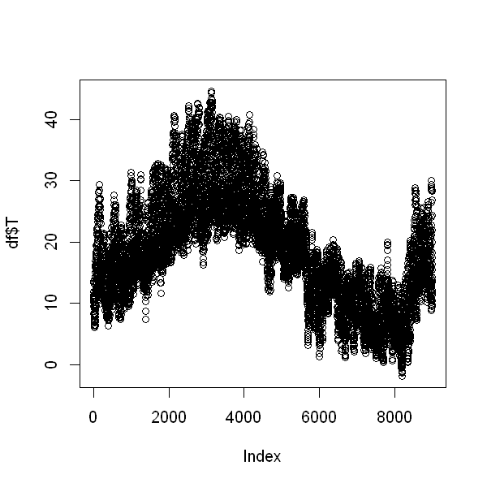
    


```R
# seasonality : Humidity
plot(df$AH)
```


    

    


```R
# let's change smooth outliers using rolling mean in two columns with long tails
containPossibleOutliers <- c("PT08.S3.NOx.", "C6H6.GT.")

outliers <- boxplot(df$PT08.S3.NOx., plot=FALSE)$out
length(outliers)
outliersPos <- which(df$PT08.S3.NOx. %in% outliers)
df[outliersPos, "PT08.S3.NOx."] <- NA

outliers <- boxplot(df$C6H6.GT., plot=FALSE)$out
length(outliers)
outliersPos <- which(df$C6H6.GT. %in% outliers)
df[outliersPos, "C6H6.GT."] <- NA

df <- imputeTS::na_ma(df, k = 4, weighting = "simple")
```


241


228


    Registered S3 method overwritten by 'quantmod':
      method            from
      as.zoo.data.frame zoo 
    


```R
calculate_sample_summary(df[3:11])
```


<table>
<thead><tr><th></th><th scope=col>PT08.S1.CO.</th><th scope=col>C6H6.GT.</th><th scope=col>PT08.S2.NMHC.</th><th scope=col>PT08.S3.NOx.</th><th scope=col>PT08.S4.NO2.</th><th scope=col>PT08.S5.O3.</th><th scope=col>T</th><th scope=col>RH</th><th scope=col>AH</th></tr></thead>
<tbody>
	<tr><th scope=row>N. Valid</th><td>8991             </td><td>8991             </td><td>8991             </td><td>8991             </td><td>8991             </td><td>8991             </td><td>8991             </td><td>8991             </td><td>8991             </td></tr>
	<tr><th scope=row>N. Missing</th><td>0                </td><td>0                </td><td>0                </td><td>0                </td><td>0                </td><td>0                </td><td>0                </td><td>0                </td><td>0                </td></tr>
	<tr><th scope=row>Mean</th><td>1099.83          </td><td>   9.63          </td><td> 939.15          </td><td> 821.81          </td><td>1456.26          </td><td>1022.91          </td><td>  18.32          </td><td>  49.23          </td><td>   1.03          </td></tr>
	<tr><th scope=row>95% CI</th><td>1095.35 : 1104.32</td><td>9.5 : 9.76       </td><td>933.64 : 944.67  </td><td>817.2 : 826.42   </td><td>1449.11 : 1463.42</td><td>1014.67 : 1031.14</td><td>18.14 : 18.5     </td><td>48.88 : 49.59    </td><td>1.02 : 1.03      </td></tr>
	<tr><th scope=row>Std</th><td>217.08           </td><td>  6.40           </td><td>266.83           </td><td>222.88           </td><td>346.21           </td><td>398.48           </td><td>  8.83           </td><td> 17.32           </td><td>  0.40           </td></tr>
	<tr><th scope=row>Min</th><td>647.00           </td><td>  0.10           </td><td>383.00           </td><td>322.00           </td><td>551.00           </td><td>221.00           </td><td> -1.90           </td><td>  9.20           </td><td>  0.18           </td></tr>
	<tr><th scope=row>Q1</th><td> 937.00          </td><td>   4.40          </td><td> 734.50          </td><td> 658.00          </td><td>1227.00          </td><td> 731.50          </td><td>  11.80          </td><td>  35.80          </td><td>   0.74          </td></tr>
	<tr><th scope=row>Median</th><td>1063.0           </td><td>   8.2           </td><td> 909.0           </td><td> 805.0           </td><td>1463.0           </td><td> 963.0           </td><td>  17.8           </td><td>  49.6           </td><td>   1.0           </td></tr>
	<tr><th scope=row>Q3</th><td>1231.00          </td><td>  13.70          </td><td>1116.00          </td><td> 968.00          </td><td>1674.00          </td><td>1273.50          </td><td>  24.40          </td><td>  62.50          </td><td>   1.31          </td></tr>
	<tr><th scope=row>Max</th><td>2040.00          </td><td>  28.40          </td><td>2214.00          </td><td>1436.00          </td><td>2775.00          </td><td>2523.00          </td><td>  44.60          </td><td>  88.70          </td><td>   2.23          </td></tr>
	<tr><th scope=row>IQR</th><td>294.00           </td><td>  9.30           </td><td>381.50           </td><td>310.00           </td><td>447.00           </td><td>542.00           </td><td> 12.60           </td><td> 26.70           </td><td>  0.57           </td></tr>
</tbody>
</table>


```R
plot(df$PT08.S3.NOx., main = 'After')
```


    

    


```R
# cross correlation
corrplot::corrplot(cor(df[3:11], method = 'spearman'), method = "ellipse", type = "lower", order = "hclust")
```


    

    


```R
# let's use CO concentration (PT08.S1.CO.)as target and all of the rest as predictors:
colnames(df)
```


<ol class=list-inline>
	<li>'Date'</li>
	<li>'Time'</li>
	<li>'PT08.S1.CO.'</li>
	<li>'C6H6.GT.'</li>
	<li>'PT08.S2.NMHC.'</li>
	<li>'PT08.S3.NOx.'</li>
	<li>'PT08.S4.NO2.'</li>
	<li>'PT08.S5.O3.'</li>
	<li>'T'</li>
	<li>'RH'</li>
	<li>'AH'</li>
</ol>


```R
# Assumptions
# Linear dependency between response and predictor
# Constant variance (a.k.a. homoscedasticity)
# Errors are normally distributed and independent
```


```R
mod <- lm(data = df, C6H6.GT.~ PT08.S1.CO.)
# if errors normaly distributed mean should be about 0
mean(mod$residuals)
# high r2 better lm fit -> linear dependency
summary(mod)$r.squared
# qqplot for checking errors for normality, Scale-location plot for homoscedasticity check
plot(mod, which = 2:3)

# -> looks fine
```


-1.4745091663805e-16


0.726270624672307


    
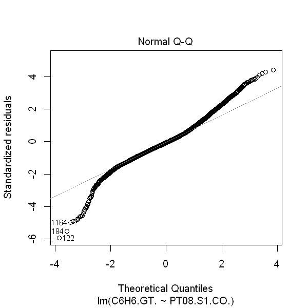
    


    

    


```R
mod <- lm(data = df, PT08.S2.NMHC.~ PT08.S1.CO.)
# if errors normaly distributed mean should be about 0
mean(mod$residuals)
# high r2 better lm fit -> linear dependency
summary(mod)$r.squared
# qqplot for checking errors for normality, Scale-location plot for homoscedasticity check
plot(mod, which = 2:3)

# -> looks fine
```


-4.2022515671481e-15


0.797385399498942


    
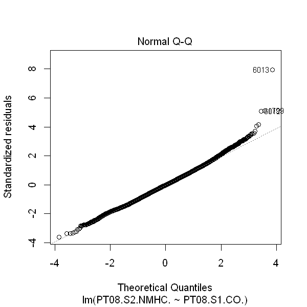
    


    

    


```R
mod <- lm(data = df, PT08.S3.NOx.~ PT08.S1.CO.)
# if errors normaly distributed mean should be about 0
mean(mod$residuals)
# high r2 better lm fit -> linear dependency
summary(mod)$r.squared
# qqplot for checking errors for normality, Scale-location plot for homoscedasticity check
plot(mod, which = 2:3)

# -> looks ratehr fine
```


1.35292270472387e-14


0.654440857153493


    
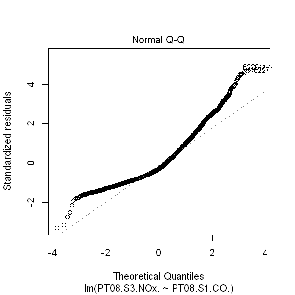
    


    
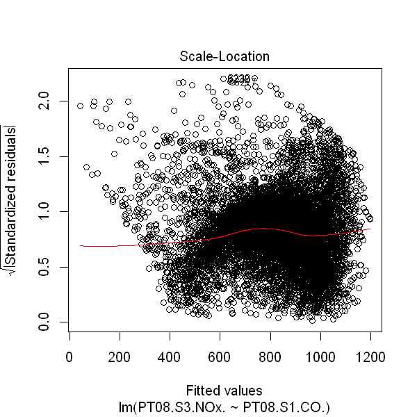
    


```R
mod <- lm(data = df, PT08.S4.NO2.~ PT08.S1.CO.)
# if errors normaly distributed mean should be about 0
mean(mod$residuals)
# high r2 better lm fit -> linear dependency
summary(mod)$r.squared
# qqplot for checking errors for normality, Scale-location plot for homoscedasticity check
plot(mod, which = 2:3)

# -> looks rather fine
```


2.05713361297366e-14


0.466326798166214


    
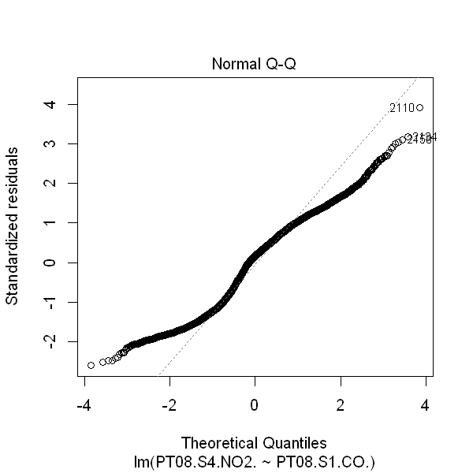
    


    

    


```R
mod <- lm(data = df, PT08.S5.O3.~ PT08.S1.CO.)
# if errors normaly distributed mean should be about 0
mean(mod$residuals)
# high r2 better lm fit -> linear dependency
summary(mod)$r.squared
# qqplot for checking errors for normality, Scale-location plot for homoscedasticity check
plot(mod, which = 2:3)

# -> looks fine
```


9.07949984058419e-15


0.808782796221731


    

    


    
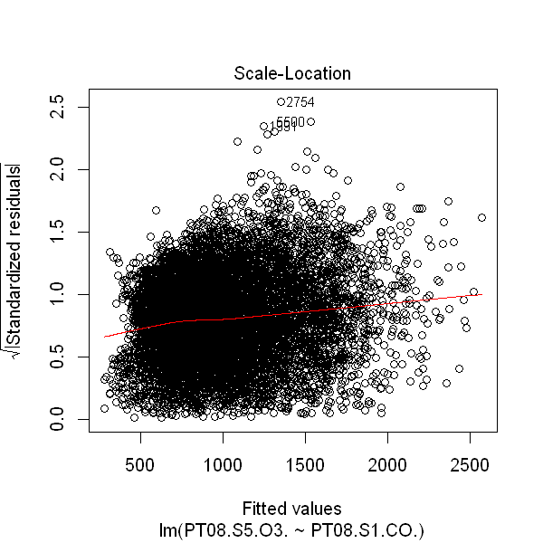
    


```R
mod <- lm(data = df, T ~ PT08.S1.CO.)
# if errors normaly distributed mean should be about 0
mean(mod$residuals)
# high r2 better lm fit -> linear dependency
summary(mod)$r.squared
# qqplot for checking errors for normality, Scale-location plot for homoscedasticity check
plot(mod, which = 2:3)

# -> looks not so fine, fails the assumptions
```


-1.05238771823968e-15


0.00236456160845212


    
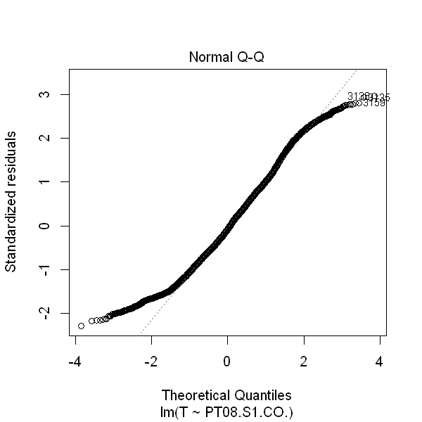
    


    
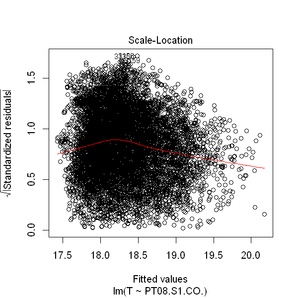
    


```R
mod <- lm(data = df, RH ~ PT08.S1.CO.)
# if errors normaly distributed mean should be about 0
mean(mod$residuals)
# high r2 better lm fit -> linear dependency
summary(mod)$r.squared
# qqplot for checking errors for normality, Scale-location plot for homoscedasticity check
plot(mod, which = 2:3)

# -> looks ratehr not so fine, fails the assumptions
```


-9.69521920697992e-16


0.0131344734986195


    

    


    
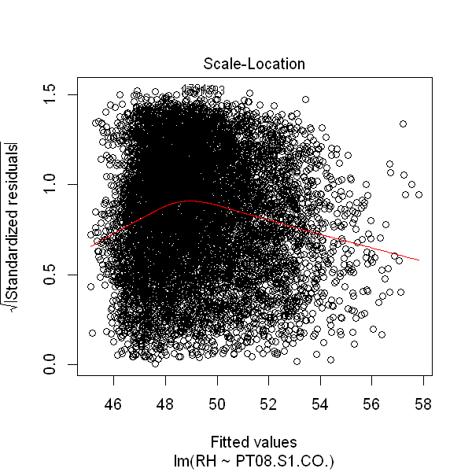
    


```R
mod <- lm(data = df, AH ~ PT08.S1.CO.)
# if errors normaly distributed mean should be about 0
mean(mod$residuals)
# high r2 better lm fit -> linear dependency
summary(mod)$r.squared
# qqplot for checking errors for normality, Scale-location plot for homoscedasticity check
plot(mod, which = 2:3)

# -> looks ratehr not so fine, fails the assumptions
```


1.7585322710981e-17


0.0183125188293068


    

    


    
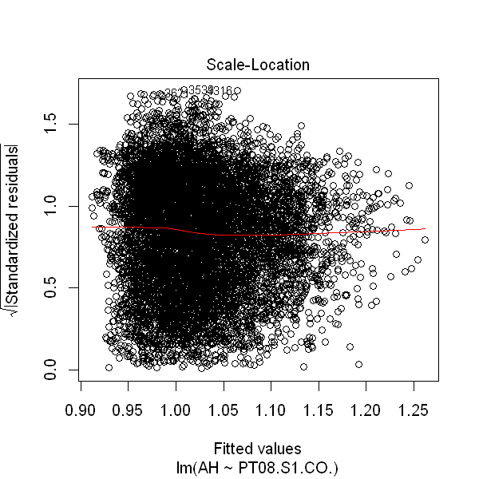
    


```R
set.seed(47)

sample <- sample.int(n = nrow(df), size = floor(.75*nrow(df))) 
train <- df[sample, ]
test <- df[-sample, ]
mod <- lm(data = df,PT08.S1.CO. ~PT08.S2.NMHC.)
summary(mod)
```


    
    Call:
    lm(formula = PT08.S1.CO. ~ PT08.S2.NMHC., data = df)
    
    Residuals:
        Min      1Q  Median      3Q     Max 
    -631.97  -65.13   -6.80   61.68  477.18 
    
    Coefficients:
                   Estimate Std. Error t value Pr(>|t|)    
    (Intercept)   4.176e+02  3.771e+00   110.7   <2e-16 ***
    PT08.S2.NMHC. 7.265e-01  3.862e-03   188.1   <2e-16 ***
    ---
    Signif. codes:  0 '***' 0.001 '**' 0.01 '*' 0.05 '.' 0.1 ' ' 1
    
    Residual standard error: 97.72 on 8989 degrees of freedom
    Multiple R-squared:  0.7974,	Adjusted R-squared:  0.7974 
    F-statistic: 3.538e+04 on 1 and 8989 DF,  p-value: < 2.2e-16
    


```R
ggplot(data = train, aes(x = PT08.S2.NMHC., y = PT08.S1.CO.)) + geom_point() + geom_smooth(method = "lm")
```

    `geom_smooth()` using formula 'y ~ x'
    


    
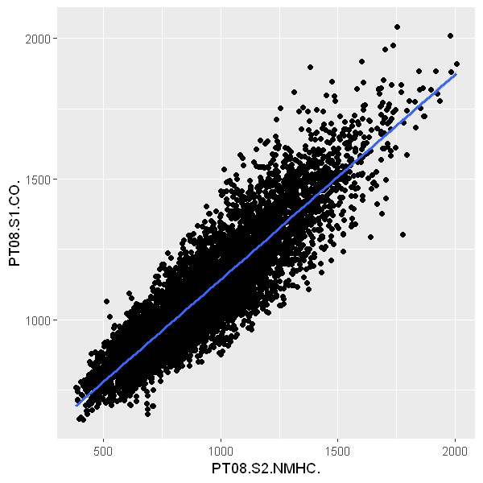
    


```R
pred <- predict(mod, newdata = test)

long <- gather(data.frame(true = test$PT08.S1.CO., predicted = pred))
long$Titan <- c(test$PT08.S2.NMHC.,test$PT08.S2.NMHC.)
colnames(long) <- c('key','CO2', 'Titan')

r2 <- summary(mod)$r.squared
pval <- summary(mod)$coefficients[1,4]
```


```R
p <- ggplot(long, aes(x=Titan, y=CO2, col = key)) + 
  geom_point()

p + ggtitle(paste("R^2 :", round(r2*100,2), ", pvalue : ", as.character(signif(pval, 3)), " :: CO2 by titan concentration"))
```


    

    

