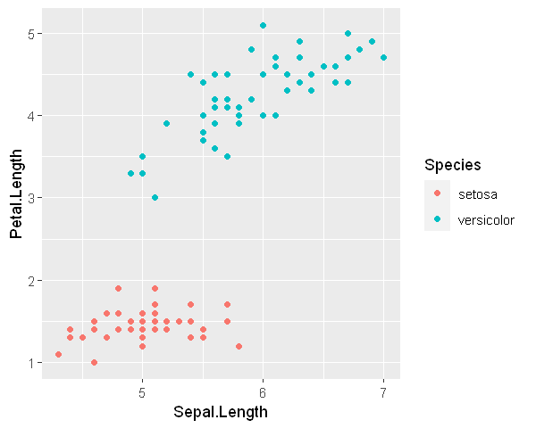
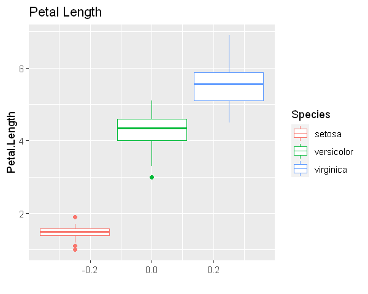
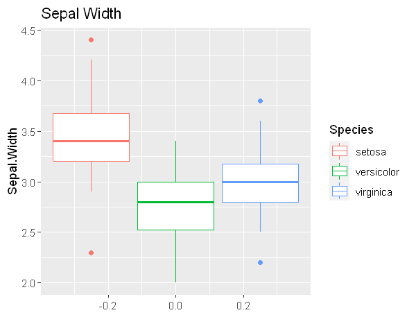
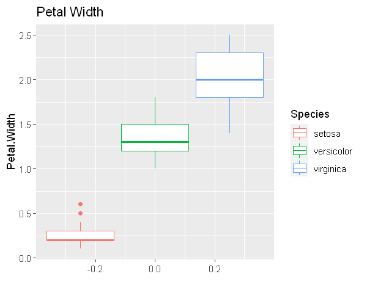
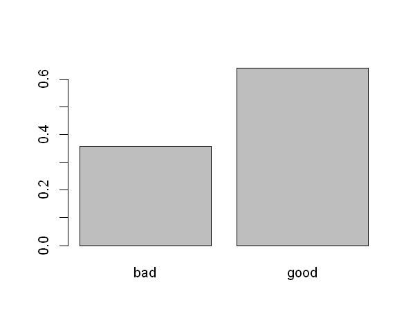
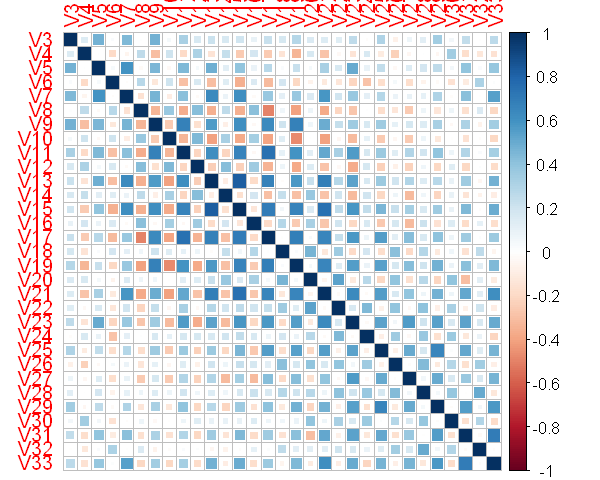
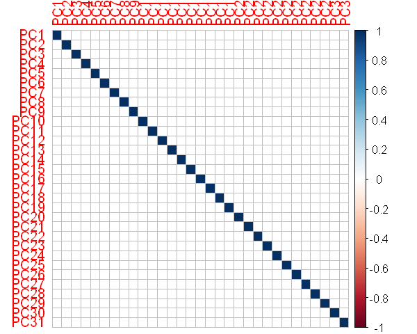
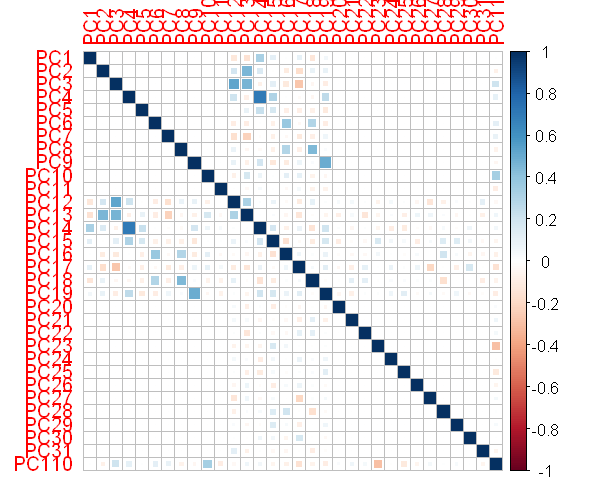

```R
options(repr.plot.width = 5, repr.plot.height = 4)
```


```R
library(ggplot2, warn.conflicts = FALSE)
library(dplyr, warn.conflicts = FALSE)
library(class, warn.conflicts = FALSE)
```

    Warning message:
    "package 'ggplot2' was built under R version 3.6.3"Warning message:
    "package 'dplyr' was built under R version 3.6.3"Warning message:
    "package 'class' was built under R version 3.6.3"

# Quality of Fit / Качество оценки 
MSE = $sum(e_i ^2)/n, e_i = y_i - f_ (x_i)$<br>

$E(e_0 ^2) = Var(f_ (x_0)) + [Bias(f_ (x_0))]^2 + Var(eps)$<br>


- Variance
- Bias
- Irreducible error

More flexibility - more variance, but less bias<br>
Больше гибкость - больше дисперсия, но меньше смещение<br>

Variance - how estimated function will change depending on different training data<br>
Дисперсия - насколько изменяется функция к изменению обучающих данных<br>

Bias - how close our function is to our data<br>
Смещение - насколько близко функция описывает данные<br>

# Quality of Fit of Classifier / Качество оценки классификатора
Error rate for train date<br>
Частота ошибок на обучающих данных<br>

$sum( I( y_i != f_(x_i) ) ) / n$<br>

For control data<br>
На контрольных<br>
$Avg( I( y0 != f_(x0) ) )$<br>

# Bayes Classifier / Баейсовский классификатор
$P(Y = j | X = x0)$ - assign the most likely class<br>
Bayes classifier produces the lowest possible test error rate<br>

For two classes<br>
$P(Y = 1 | X = x0) > 0.5 // 1-P$<br>


```R
qplot(Sepal.Length, Petal.Length, data = iris[1:100, ], color = Species)
```


    

    


Bayes Classifier produces the lowest level of test error rate<br>
Обеспечивает наименьшую возможную частоту ошибок на контрольной выборке<br>
$1 - max_j P(Y = j | X = x0)$<br>

Total bayes error rate is an analogous to the irreducible rate<br>
Общая байесовская частота ошибок (по всем значениям Х) - аналог неустранимой ошибки<br>
$1 - E(max_j P(Y = j | X))$<br>

Real distributions are (in general) unknown<br>
Реальные условные распределения нам (как правило) не известны.<br>


```R
qplot(data = iris, y = Sepal.Length, color = Species, geom = "boxplot", main = "Sepal Length")
qplot(data = iris, y = Petal.Length, color = Species, geom = "boxplot", main = "Petal Length")
qplot(data = iris, y = Sepal.Width, color = Species, geom = "boxplot", main = "Sepal Width")
qplot(data = iris, y = Petal.Width, color = Species, geom = "boxplot", main = "Petal Width")
```


    

    


    

    


    

    


    

    


# K Nearest Neighbours / Метод К ближайших соседей . KNN
$P(Y = j | X = x0) = sum( I(y_k = j) ) / K$, K - number of nearest neighbourgs, число ближайших соседей<br>

This classifier can be very close to Bayes Classifier<br>
Полученный классификатор может оказаться очень близко к байесовскому.<br>

How to choose k?<br>
Главный вопрос - выбор К:<br>
К = 1 - слишком гибко, too flexible<br>
К = 100 - слишком грубо, too rough<br>

Variance ~ Bias<br>
Дисперсия ~ Смещение<br>


```R
set.seed(3)
# class::knn
test <- c(1:10, 51:60, 101:110)

pred_knn <- knn(train = iris[-test, "Sepal.Width", drop = F],
                test = iris[test, "Sepal.Width", drop = F],
                
                cl = iris[-test, "Species"],
                k = 1)

table(pred_knn, Real = iris[test, "Species"])
```


                Real
    pred_knn     setosa versicolor virginica
      setosa          5          0         2
      versicolor      1          4         5
      virginica       4          6         3


```R
(5+4+3)/30
```


0.4


# Logistic Regression / Логистическая регрессия<br>

$p(X) = exp^(b0+ b1x1 +...) / (1 + exp^(b0 + b1x1 +...))$<br>

$p(X)/(1-p(X)) = exp^(b0+b1x1)$ - odds ratio отношение шансов 0.2 0.8 1:4<br>

$log(p(X)/(1-p(X))) = b0 + b1x1$ - logit<br>


```R
df_sepal <- iris %>% filter(Species != "setosa")
df_sepal$Species <- factor(df_sepal$Species)
str(df_sepal)
```

    'data.frame':	100 obs. of  5 variables:
     $ Sepal.Length: num  7 6.4 6.9 5.5 6.5 5.7 6.3 4.9 6.6 5.2 ...
     $ Sepal.Width : num  3.2 3.2 3.1 2.3 2.8 2.8 3.3 2.4 2.9 2.7 ...
     $ Petal.Length: num  4.7 4.5 4.9 4 4.6 4.5 4.7 3.3 4.6 3.9 ...
     $ Petal.Width : num  1.4 1.5 1.5 1.3 1.5 1.3 1.6 1 1.3 1.4 ...
     $ Species     : Factor w/ 2 levels "versicolor","virginica": 1 1 1 1 1 1 1 1 1 1 ...
    


```R
glm_fit_all <- glm(Species ~ ., data = df_sepal, family = "binomial")
summary(glm_fit_all)
```


    
    Call:
    glm(formula = Species ~ ., family = "binomial", data = df_sepal)
    
    Deviance Residuals: 
         Min        1Q    Median        3Q       Max  
    -2.01105  -0.00541  -0.00001   0.00677   1.78065  
    
    Coefficients:
                 Estimate Std. Error z value Pr(>|z|)  
    (Intercept)   -42.638     25.707  -1.659   0.0972 .
    Sepal.Length   -2.465      2.394  -1.030   0.3032  
    Sepal.Width    -6.681      4.480  -1.491   0.1359  
    Petal.Length    9.429      4.737   1.991   0.0465 *
    Petal.Width    18.286      9.743   1.877   0.0605 .
    ---
    Signif. codes:  0 '***' 0.001 '**' 0.01 '*' 0.05 '.' 0.1 ' ' 1
    
    (Dispersion parameter for binomial family taken to be 1)
    
        Null deviance: 138.629  on 99  degrees of freedom
    Residual deviance:  11.899  on 95  degrees of freedom
    AIC: 21.899
    
    Number of Fisher Scoring iterations: 10
    


```R
cor(df_sepal[, -5])
```


<table>
<thead><tr><th></th><th scope=col>Sepal.Length</th><th scope=col>Sepal.Width</th><th scope=col>Petal.Length</th><th scope=col>Petal.Width</th></tr></thead>
<tbody>
	<tr><th scope=row>Sepal.Length</th><td>1.0000000</td><td>0.5538548</td><td>0.8284787</td><td>0.5937094</td></tr>
	<tr><th scope=row>Sepal.Width</th><td>0.5538548</td><td>1.0000000</td><td>0.5198023</td><td>0.5662025</td></tr>
	<tr><th scope=row>Petal.Length</th><td>0.8284787</td><td>0.5198023</td><td>1.0000000</td><td>0.8233476</td></tr>
	<tr><th scope=row>Petal.Width</th><td>0.5937094</td><td>0.5662025</td><td>0.8233476</td><td>1.0000000</td></tr>
</tbody>
</table>


# TASK. CLASSIFICATION part1
- Take some dataset containing binomial categorical variable as a response
- Build classification with knn
- Build classification based on logit-regression
- Compare results. Which method works better for you?


```R
library(mlbench)
data(Ionosphere)
ionosphere <- Ionosphere
```

    Warning message:
    "package 'mlbench' was built under R version 3.6.3"


```R
head(ionosphere[26:35],2)%>% knitr::kable()
```


    
    
    |      V26|      V27|      V28|      V29|      V30|      V31|      V32|      V33|      V34|Class |
    |--------:|--------:|--------:|--------:|--------:|--------:|--------:|--------:|--------:|:-----|
    | -0.51171|  0.41078| -0.46168|  0.21266| -0.34090|  0.42267| -0.54487|  0.18641| -0.45300|good  |
    | -0.26569| -0.20468| -0.18401| -0.19040| -0.11593| -0.16626| -0.06288| -0.13738| -0.02447|bad   |


```R
barplot(prop.table(table(as.factor(unlist(ionosphere$Class)))))
```


    

    


```R
dim(ionosphere)[[1]]
dim(ionosphere)[[1]] - dim(ionosphere)[[1]]*0.3
```


351


245.7


# KNN


```R
test <- c(245:351)
acc <- c()
for (K in 1:20){
pred_knn <- knn(train = ionosphere[-test, colnames(ionosphere[1:34]), drop = F],
                test = ionosphere[test, colnames(ionosphere[1:34]), drop = F],
                cl = ionosphere[-test, "Class"],
                k = K)

                acc <- c(acc, mean(pred_knn == ionosphere[test, "Class"]))
}
plot(acc, main = 'Accuracy per K', xlab = 'K', ylab = 'accuracy')
```


    

    


```R
pred_knn <- knn(train = ionosphere[-test, colnames(ionosphere[1:34]), drop = F],
                test = ionosphere[test, colnames(ionosphere[1:34]), drop = F],
                cl = ionosphere[-test, "Class"],
                k = which.max(acc))

table(pred_knn, Real = ionosphere[test, "Class"])
round(mean(pred_knn == ionosphere[test, "Class"])*100,2)
```


            Real
    pred_knn bad good
        bad    5    2
        good   0  100


98.13


# Logistic regression


```R
ionosphere$Class <- factor(ionosphere$Class)
```


```R
corrplot::corrplot(cor(ionosphere[3:33]), method = "square")
```


    

    


```R
ionosphere_decor  <- prcomp(ionosphere[colnames(ionosphere[4:34])],retx=TRUE, center = TRUE, scale. = TRUE)$x
corrplot::corrplot(cor(ionosphere_decor), method = "square")
```


    

    


```R
ionosphere_decor <- as.data.frame(ionosphere_decor)
```


```R
ionosphere_decor$PC12 <- ionosphere_decor$PC1*ionosphere_decor$PC2
ionosphere_decor$PC13 <- ionosphere_decor$PC1*ionosphere_decor$PC3
ionosphere_decor$PC14 <- ionosphere_decor$PC1*ionosphere_decor$PC4
ionosphere_decor$PC15 <- ionosphere_decor$PC1*ionosphere_decor$PC5
ionosphere_decor$PC16 <- ionosphere_decor$PC1*ionosphere_decor$PC6
ionosphere_decor$PC17 <- ionosphere_decor$PC1*ionosphere_decor$PC7
ionosphere_decor$PC18 <- ionosphere_decor$PC1*ionosphere_decor$PC8
ionosphere_decor$PC19 <- ionosphere_decor$PC1*ionosphere_decor$PC9
ionosphere_decor$PC110 <- ionosphere_decor$PC1*ionosphere_decor$PC10

corrplot::corrplot(cor(ionosphere_decor), method = "square")
```


    

    


```R
ionosphere_decor$Class <- ionosphere$Class
```


```R
COLS <- c('PC13','PC14','PC15','PC17','PC18','PC19','PC1','PC2','PC3','PC4','PC5','Class')
```


```R
glm_fit <- glm(Class ~ ., data = ionosphere_decor[-test, colnames(ionosphere_decor[COLS])], family = "binomial")
```


```R
summary(glm_fit)
```


    
    Call:
    glm(formula = Class ~ ., family = "binomial", data = ionosphere_decor[-test, 
        colnames(ionosphere_decor[COLS])])
    
    Deviance Residuals: 
         Min        1Q    Median        3Q       Max  
    -2.50500  -0.43887   0.00089   0.70040   2.46071  
    
    Coefficients:
                Estimate Std. Error z value Pr(>|z|)    
    (Intercept)  0.40575    0.22237   1.825 0.068051 .  
    PC13        -0.29981    0.06844  -4.381 1.18e-05 ***
    PC14         0.16306    0.09632   1.693 0.090451 .  
    PC15         0.11137    0.05833   1.909 0.056206 .  
    PC17         0.27001    0.08083   3.340 0.000837 ***
    PC18        -0.03950    0.08926  -0.443 0.658107    
    PC19         0.23349    0.11767   1.984 0.047235 *  
    PC1         -0.27576    0.09558  -2.885 0.003913 ** 
    PC2          0.26435    0.11950   2.212 0.026955 *  
    PC3         -0.43787    0.16641  -2.631 0.008508 ** 
    PC4          0.99008    0.22841   4.335 1.46e-05 ***
    PC5          0.43743    0.14202   3.080 0.002069 ** 
    ---
    Signif. codes:  0 '***' 0.001 '**' 0.01 '*' 0.05 '.' 0.1 ' ' 1
    
    (Dispersion parameter for binomial family taken to be 1)
    
        Null deviance: 338.24  on 243  degrees of freedom
    Residual deviance: 194.19  on 232  degrees of freedom
    AIC: 218.19
    
    Number of Fisher Scoring iterations: 7
    


```R
pred_glm <- predict(glm_fit, ionosphere_decor[test, colnames(ionosphere_decor)], type = "response") > .5
table(pred_glm, Real = ionosphere_decor[test, 'Class'])
round((4+97)/107*100,2)
```


            Real
    pred_glm bad good
       FALSE   4    5
       TRUE    1   97


94.39


# Result

K-nearest neighbors worked better of test data, and worked ok with all of the features, even though some of them are highly correlated.
