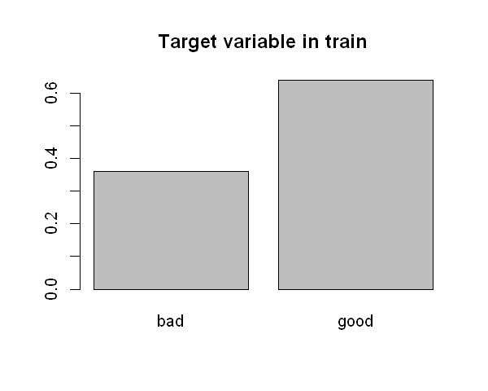
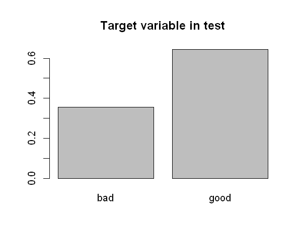
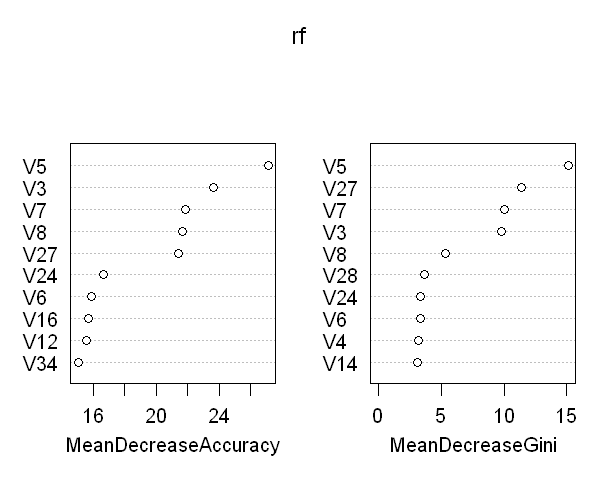
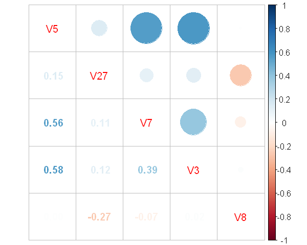

```R
# global graphics options
options(repr.plot.width = 5, repr.plot.height = 4)
```


```R
# import necessary packages
library(ggplot2, warn.conflicts = FALSE) # graphics
library(class, warn.conflicts = FALSE) # knn
library(healthcareai, warn.conflicts = FALSE) # train-test-split
library(randomForest, warn.conflicts = FALSE) # feature importances
library(corrplot) # cross-correlations
library(mlbench) # data
```


# TASK. CLASSIFICATION part1
- Take some dataset containing binomial categorical variable as a response
- Build classification with knn
- Build classification based on logit-regression
- Compare results. Which method works better for you?


```R
# load data
data(Ionosphere)
ionosphere <- Ionosphere
ionosphere[is.na(ionosphere)] <- -1 # encode missing values with -1
```


```R
# train-test-split 7:3
set.seed(17)
ionosphere <- split_train_test(ionosphere, Class, percent_train = 0.7)

head(ionosphere$train[26:35], 2) %>%
    knitr::kable()
```


    
    
    |      V26|      V27|      V28|      V29|      V30|      V31|      V32|      V33|      V34|Class |
    |--------:|--------:|--------:|--------:|--------:|--------:|--------:|--------:|--------:|:-----|
    | -0.51171|  0.41078| -0.46168|  0.21266| -0.34090|  0.42267| -0.54487|  0.18641| -0.45300|good  |
    | -0.26569| -0.20468| -0.18401| -0.19040| -0.11593| -0.16626| -0.06288| -0.13738| -0.02447|bad   |


```R
# countplot on target variable in Train
barplot(prop.table(table(as.factor(unlist(ionosphere$train$Class)))), main = "Target variable in train")
```


    

    


```R
# countplot on target variable in Test
barplot(prop.table(table(as.factor(unlist(ionosphere$test$Class)))), main = "Target variable in test")
```


    

    


```R
# feature importance calculation using random forest
set.seed(17)

rf <- randomForest(Class ~ ., data = ionosphere$train, ntree = 1000, keep.forest = FALSE,
    importance = TRUE)
varImpPlot(rf, n.var = 10)
```


    

    


```R
columns_to_use <- c("V5", "V27", "V7", "V3", "V8", "Class")

c <- cor(within(ionosphere$train[, columns_to_use], rm(Class)))
corrplot.mixed(c)
```


    

    


```R
# - 'V7', 'V3' - drop one of the most correlated features, above 0.5
columns_to_use <- c("V5", "V4", "V8", "V27", "Class")
```

# KNN


```R
# predict test with KNN
pred_knn <- knn(train = within(ionosphere$train[, columns_to_use], rm(Class)), test = within(ionosphere$test[,
    columns_to_use], rm(Class)), cl = ionosphere$train$Class, k = 3)

table(pred_knn, Real = ionosphere$test$Class)
round(mean(pred_knn == ionosphere$test$Class) * 100, 2)
```


            Real
    pred_knn bad good
        bad   31    4
        good   6   63


90.38


# Logistic regression


```R
# target to factor for logistic regression
ionosphere$train$Class <- factor(ionosphere$train$Class)
```


```R
# predict test with LogisticRegression
glm_fit <- glm(Class ~ ., data = ionosphere$train[, columns_to_use], family = "binomial")
```


```R
summary(glm_fit)
```


    
    Call:
    glm(formula = Class ~ ., family = "binomial", data = ionosphere$train[, 
        columns_to_use])
    
    Deviance Residuals: 
        Min       1Q   Median       3Q      Max  
    -2.6532  -0.4461   0.4379   0.6933   1.7299  
    
    Coefficients:
                Estimate Std. Error z value Pr(>|z|)    
    (Intercept)  -1.1407     0.3592  -3.175  0.00150 ** 
    V5            3.6850     0.5397   6.828  8.6e-12 ***
    V4            0.9058     0.4431   2.044  0.04096 *  
    V8            1.1565     0.3751   3.083  0.00205 ** 
    V27          -1.1169     0.4180  -2.672  0.00754 ** 
    ---
    Signif. codes:  0 '***' 0.001 '**' 0.01 '*' 0.05 '.' 0.1 ' ' 1
    
    (Dispersion parameter for binomial family taken to be 1)
    
        Null deviance: 322.88  on 246  degrees of freedom
    Residual deviance: 212.59  on 242  degrees of freedom
    AIC: 222.59
    
    Number of Fisher Scoring iterations: 5
    


```R
pred_glm <- predict(glm_fit, within(ionosphere$test[, columns_to_use], rm(Class)),
    type = "response") > 0.5
table(pred_glm, Real = ionosphere$test$Class)
```


            Real
    pred_glm bad good
       FALSE  21    6
       TRUE   16   61


```R
(26 + 61)/(26 + 59 + 8 + 11)
```


0.836538461538462


# Result

K-nearest neighbors performed better on test data (~92% acc vs. ~84% acc) while using the same features for both models and using a balanced, stratified test sample.
