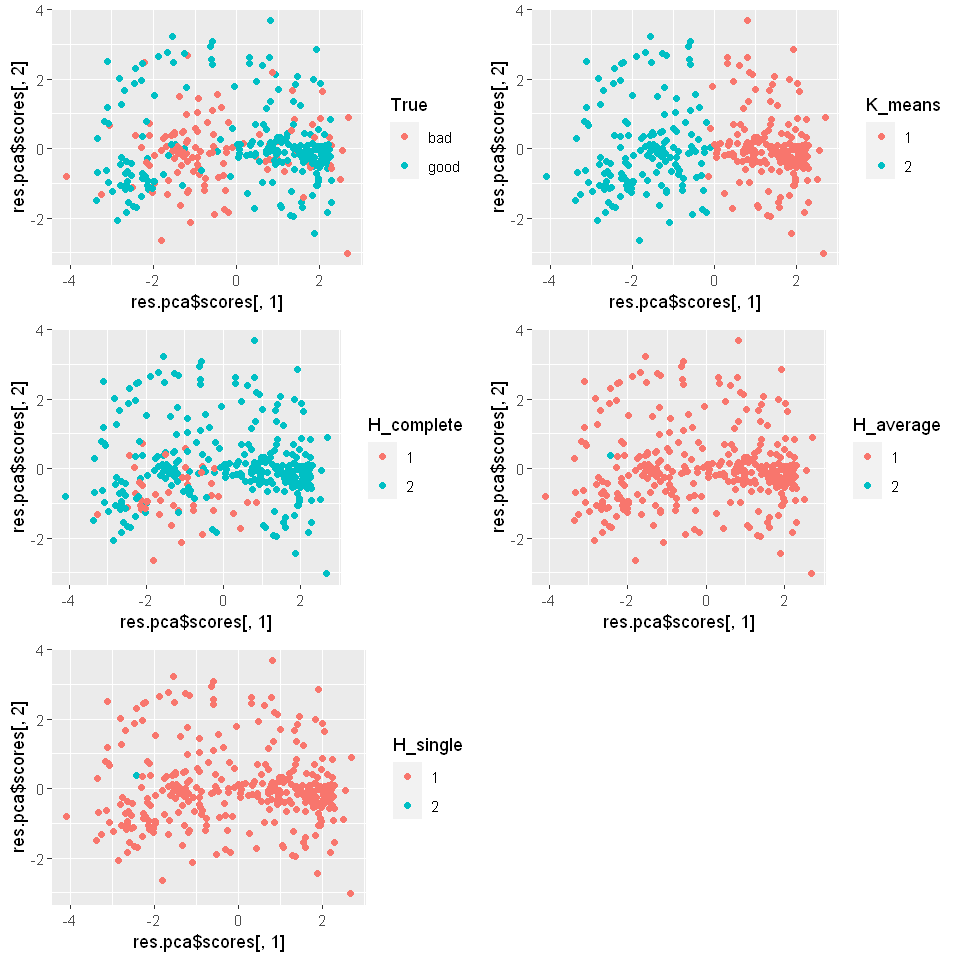
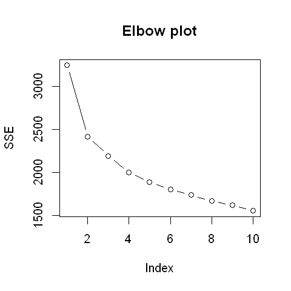

```R
# global graphics options
options(repr.plot.width = 8, repr.plot.height = 8)

# import necessary packages
library(ggplot2, warn.conflicts = FALSE)  # graphics
library(corrplot, warn.conflicts = FALSE)  # cross-correlations
library(mlbench, warn.conflicts = FALSE)  # data
library(gridExtra, warn.conflicts = FALSE)
```

# TASK. CLUSTERING 
- Take same dataset as for classification but without response
- Build clusters with k-means and hclust
- Make an interpretation (descriptive stats and ideas)
- Compare results


```R
# load data
data(Ionosphere)
ionosphere <- Ionosphere
ionosphere[is.na(ionosphere)] <- -1  # encode missing values with -1
ionosphere <- na.omit(ionosphere)
```


```R
columns_to_use <- 1:34#c("V5", "V8", "V27")
```


```R
set.seed(4)
km_res <- kmeans(ionosphere[, columns_to_use], 2, nstart = 20)
```


```R
h_complete <- hclust(dist(ionosphere[, columns_to_use]), method = "complete")
h_complete <- cutree(h_complete, k = 2)

h_average <- hclust(dist(ionosphere[, columns_to_use]), method = "average")
h_average <- cutree(h_average, k = 2)

h_single <- hclust(dist(ionosphere[, columns_to_use]), method = "single")
h_single <- cutree(h_single, k = 2)
```


```R
res.pca <- princomp(ionosphere[, 3:34])
```


```R
require(gridExtra)


cl <- data.frame(K_means = as.factor(km_res$cluster))
cl$True <- ionosphere$Class
cl$H_complete <- as.factor(h_complete)
cl$H_average <- as.factor(h_average)
cl$H_single <- as.factor(h_single)

p1 <- qplot(res.pca$scores[, 1], res.pca$scores[, 2], color = True, data = cl)
p2 <- qplot(res.pca$scores[, 1], res.pca$scores[, 2], color = K_means, data = cl)
p3 <- qplot(res.pca$scores[, 1], res.pca$scores[, 2], color = H_complete, data = cl)
p4 <- qplot(res.pca$scores[, 1], res.pca$scores[, 2], color = H_average, data = cl)
p5 <- qplot(res.pca$scores[, 1], res.pca$scores[, 2], color = H_single, data = cl)

grid.arrange(p1, p2, p3, p4, p5, ncol = 2, nrow = 3)
```


    

    


# Result

It seems that this data cannot be reasonably clustered using k-means, in hclust on the original data. Clusters are formed by distance when the data are categorically separable.


```R
options(repr.plot.width = 4, repr.plot.height = 4)

SSE <- rep(0, 10)

set.seed(8)
for (k in 1:10) {
    SSE[k] <- kmeans(ionosphere[, 1:34], k, nstart = 20)$tot.withinss
}

plot(SSE, type = "b", main = 'Elbow plot')
```


    

    


```R

```
